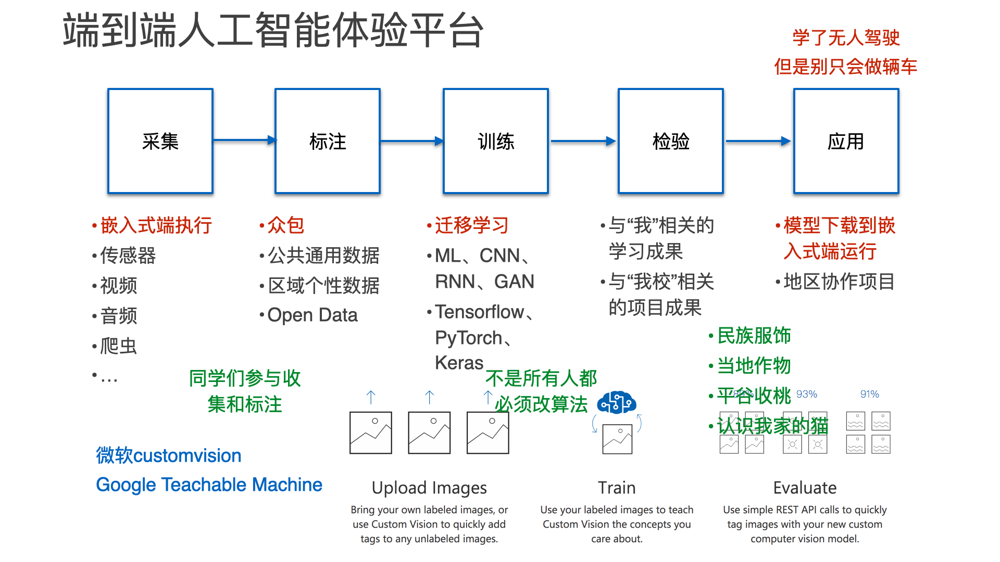
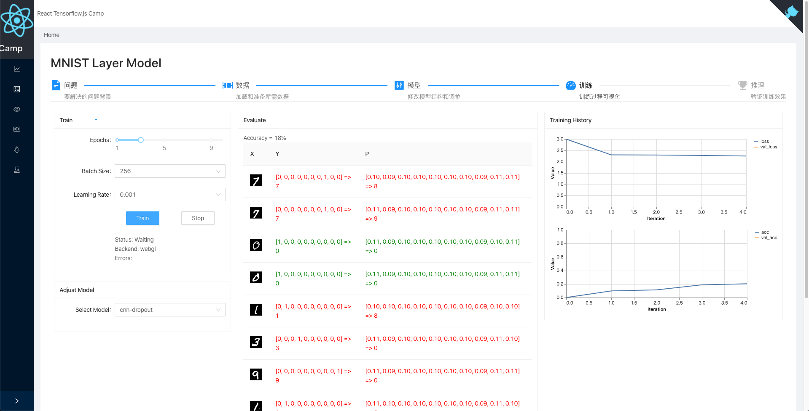

# react-tfjs-camp 全栈 AI 训练

这是一个以学习 tensorflow.js 为目的的项目。使用 React Hooks + Typescript 实现主要界面。

BTW，这是个平民 AI 教程，可以不使用 GPU 完成。

## 技术栈

最近版本，在以下技术栈上运行。

* TypeScript (v3.7.2)
* React (v16.12) : react-scripts, react-hooks, react-router
* Tensorflow.js (v1.7.1)
* AntD(v4.1.0) & AntV/bizcharts

### 快速开始

更多内容，请移步后面的 “开发教程 Develop Tutorial” 部分

* 下载代码

		$ git clone https://github.com/iascchen/react-tfjs-camp.git
		$ cd react-tfjs-camp

* Web APP 服务

	    $ yarn
	    $ yarn start
    
	Open [http://loalhost:3000](http://loalhost:3000)

* 使用 Node.js 的代码部分

		$ cd node
		$ yarn
		$ yarn run ts-node ./src/*/train.ts ...

* 使用 Docker

	考虑到在国内安装 tensorflow.js 的 node、node-gpu 部分比较慢，所以做了一个 Docker Image，也算是个开箱即用的实验环境。
	
	目前，编译好的 Docker Image 目前还没上传（待 Release 版本之后再传）。
	
	下面的脚本，有兴趣的同学可以打开看看。

	* 使用 Dockerfile Build，会生成 `iasc/react-tfjs-capm` 的 Docker Image。
	
			$ ./docker_build.sh
		
	* 运行 Docker。这个脚本为 Docker 环境中的 `/public/model`、`/public/data` 两个目录做了本地映射，便于集成您自己使用的数据和训练的模型。
	
			$ ./docker_run.sh
	
### 关键目录

	.
	|____node    tfjs-node 代码，用于部分模型训练，比在浏览器中快不少。
	|____src     React Tensorflow.js Camp 的 Web App 代码 
	|____public
	| |____model    用于存放你自己的模型，可以直接在 Web App 中使用 fetch('/model/...') 获取
	| |____data     用于存放你自己的数据，可以直接在 Web App 中使用 fetch('/data/...') 获取
	| |____preload  预先下载好的数据和模型，因为体积太大，并不放在 git 里。打包在 Docker Image 中。
	| | |____model  Web App中使用 fetch('/preload/model/...') 获取到。node.js 中使用文件访问相对路径获取，如：fetchLocal('../public/preload/model')
	| | |____data   

## AI 概念 AI Concept

AI 概念相关的文档内容会放在 `public/docs/ai` 目录下。这些个目录下的内容，在Web APP 程序运行时，会展示在“问题”标签页面下。

学习新的技术，仅仅看看文档，跑几个例子，基本上也就能够了解了。不过要想真正深入了解这个技术的优缺点，在初步学习的基础上，还得按照自己的想法做点东西。

这个项目的开始比较随性，2020 年的 COVID-19 疫情宅家期间，列了个 AI 技术实践点的列表，起了个 Repo，只是想着把 TFJS Example 的典型例子重刷一遍，能够留下些学习的记录，希望对大家有些帮助。

做例子的过程，以前用 Python 也曾经撸过一遍，学习后个人的体会是：各个例子比较散，这样去学习 TF 与 AI，往往是关注模型，多过关注问题本身，难于形成全局的概念。而且，算法和模型天天都在进化，日日都有新论文发出来，要理解 AI 相关的技术，还是要去思考和理解一些更本质的东西。因此，在做了几个 TFJS 的例子之后，我开始对 Web APP 的内容和结构做调整，几经调整之后，成了这个程序现在的模样。

一年多前，曾有个为人工智能的初学者提供一个“端到端”的学习和体验的平台的想法。

所谓端到端，就是从领域问题出发，思考所需的数据，运用相应的模型，执行训练，验证推理，形成新应用。这个过程，我自己理解是“从数据出发”的科学探究方法的延伸，就像是古人观测天象、记录物理现象一样。而未来和过去不一样的地方在于，我们可以利用计算机和 AI ，处理更大量的数据，发现隐藏的更深的规律。

从这个起点出发，甄选了一些 AI 学习的例子，在展现上，将对 AI 概念解释、与参数交互直接体验结合起来，最终形成了当前 React-tfjs-camp 的模样。

### 代码部分

- [x] 第一部分，AI 来做加减乘除。从传统的实验数据记录处理问题出发，以曲线拟合、经典的 IRIS 鸢尾花为例，介绍了 Tensor、神经元模型、线性回归、以及多层感知机。
- [x] 第二部分，AI 识数。用 AI 学习的 Hello World 程序 MNIST，介绍了这个例子的数据加载、体验使用不同模型计算的差别，还提供了一个手写数字识别画板，可以直接看到学习前后，模型给出结果的差异。对于 MNIST 的训练学习部分，利用 Tensorflow 的 高级模型 LayerModel 和基础模型 Graph 分别做了实现。实现的过程并不太顺利，因为太多的数据放在内存之中，会导致内存溢出，程序不可用，这也许是目前在浏览器中做 AI 训练不可逾越的困难吧。不过最终，还是通过调整参数，规避了这个问题。
- [x] 第三部分，迁移学习。以 Mobilenet 模型为基础，重点讨论的是如何使用预训练的模型，介绍了四个例子。分别是：直接使用 Mobilenet 执行图片分类、Mobilenet + 机器学习 KNN 实现 Teachable Machine、在 Mobilenet 的基础上进行模型扩展实现个性化的图片分类器、以及扩展 Mobilenet以进行简单的对象识别的例子。之所以选择这些例子，是因为这些例子更多的体现了边缘计算 AI 应用的特点，即：在后台大数据计算形成的基础模型之上，利用用户端的计算能力，完成个性化的新任务。
- [x] 第四部分，处理连续数据。语言、音乐、文字、侦测信号，都是连续数据的典型应用。这部分集成了：Jena 气象预测，以展示时序数据和 RNN 的使用；IMDB 数据的语义分析，为了介绍对于文本处理的基本办法，例如 Multihot 或 词嵌入；使用 LSTM 进行文本，初步介绍文本生成模型。这几个例子，在浏览器端“爬”得比较吃力，所以，也提供了基于 TFJS Example 的 Node.js 例子的 TypeScript 版本，可以较快的完成训练。
- [x] 第五部分，预训练模型的使用。集成了 Handpose、Facemesh、Posenet 三个有趣的模型，展示的主要是如何通过摄像头和预训练的 AI 模型交互。

这五个部分，是结合 Tensorflow.js 学习 AI 的最基础内容，所有的内容，都包括如何使用 JS 完成相应的界面的交互。希望这个 Repo 能够成为 AI 学习的练习场，在实现过程中，也会穿插所需要的前后端技术，能够为想了解全栈开发技术的同学提供帮助，也可以形成一个 AI 工具集。

此项目使用 MIT 许可。不过，此项目的部分代码源自于Google 的 tfjs-examples 和 tfjs-model，根据项目需要做了改写。在代码中，我保留了 Google 的 Apache v2 License 声明，使用时请了解。

参考书目：

* 《Deep Learning with Python》 Manning
* 《Deep Learning with JavaScript》 Manning
* 《Deep Learning》 花书
* 逐渐补充...

### 文档部分

- [x] [AI Concept 1 曲线拟合](./public/docs/ai/curve.md)
- [x] [AI Concept 2 鸢尾花](./public/docs/ai/iris.md)
- [ ] [AI Concept 3 MNIST Keras 模型](./public/docs/ai/mnist-layer-model.md)
- [ ] [AI Concept 4 MNIST Core API 实现](./public/docs/ai/mnist-core-api.md)
- [ ] [AI Concept 5 Mobilenet](./public/docs/ai/mobilenet.md)
- [ ] [AI Concept 6 Mobilenet + KNN](./public/docs/ai/mobilenet-knn.md)
- [ ] [AI Concept 7 Mobilenet 迁移学习](./public/docs/ai/mobilenet-transfer.md)
- [ ] [AI Concept 8 Mobilenet 简单对象检测](./public/docs/ai/mobilenet-obj-detector.md)
- [ ] [AI Concept 9 Jena 气象预报](./public/docs/ai/jena.md)
- [ ] [AI Concept 10 IMDB 语义分类](./public/docs/ai/sentiment-imdb.md)
- [ ] [AI Concept 11 LSTM 文本生成](./public/docs/ai/lstm-txt-gen.md)
- [ ] [AI Concept 12 和摄像头交互的预训练模型](./public/docs/ai/model-with-stream.md)

## 开发教程 Develop Tutorial

这部分内容放在 `public/docs/dev` 目录下，主要是 Step by Step 的开发教程。

尽量少说废话，不做过多展开，向 MIT Fablab 学习，提供参考链接供您深入了解。

### 构建开发框架

- [x] [Develop Tutorial 1 从零开始](./public/docs/dev/start-from-scratch.md)
- [x] [Develop Tutorial 2 构建 React 开发框架](./public/docs/dev/dev-structure.md)
- [x] [Develop Tutorial 3 搭建展示端到端 AI 概念的舞台](./public/docs/dev/ai-process-panel.md)

### 操练 Tensorflow.js

- [ ] [Develop Tutorial 4 初步了解 Tensorflow.js](./public/docs/dev/tfjs-intro.md)
- [ ] 待续
