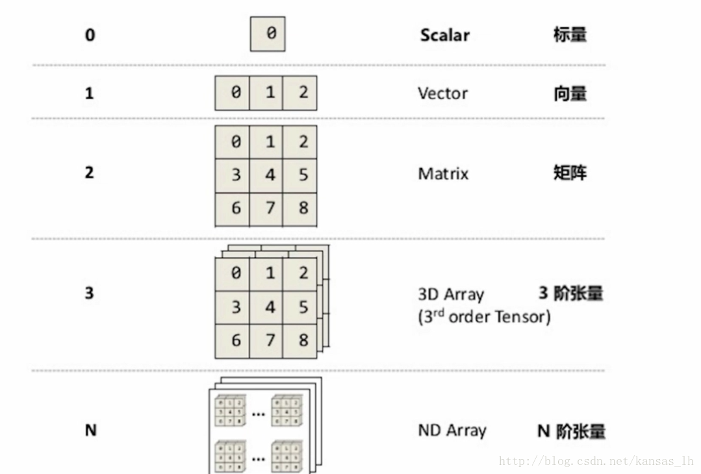
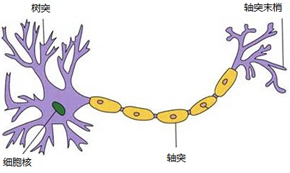
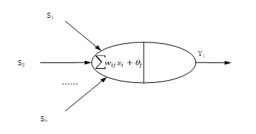

# 曲线拟合 Curve 

## 知识点

这个例子涉及以下的 AI 知识点：

* Tensor及其计算
* 神经元模型
* 多层感知机网络
* 激活函数

## 问题

每隔不久，朋友圈里都会流传一些幼儿园考题，撩骚大家重温幼儿园无忧无虑的幸福时光，还会让你自卑地抱(jie)怨(chao)，智商比不过小学生。

 

让我们来猜猜下面数据的关系：
	
	X = [1, 2, 3, 4, 5, 6, 8, 9, 10]
	Y = [15, 39, 77, 129, 195, 275, 369, 477, 599, 735]
	
	x = 11, y = ?

似乎不太好猜。

我们让 AI 也来做类似的试题：

$$ Y = f(X) $$

给出一组 X 和 Y 的对应“训练数据”，让 AI 学习其中的规律，然后随机给出一个数字 x ，让 AI 计算应该得什么 y。

## 数据

我们先用程序生成一组 X, Y 的 对应关系。

$$ y = a x^2 + b x + c $$

a, b, c 三个参数随机生成。tfjs 里面有好几种用于生成随机数的方法，用起来非常简便。下面的代码生成了 0 到 10 之间的三个随机数，我们取整之后，用作 a, b, c。 

		import * as tf from '@tensorflow/tfjs-node'
		let params = tf.randomUniform([3], 0, 10).toInt()
		params.print()
		let [a, b, c] = Array.from(params.dataSync())
		console.log(a, b, c)

上面题目中的数据，就使用以下的代码计算生成 a, b, c 分别取值 7, 3, 5。需要注意的是，这种链式的调用仅仅与顺序有关，没有先乘除后加减的计算符的优先级。

		import * as tf from '@tensorflow/tfjs'
		let x = tf.range(1, 12)
		let y = x.pow(2).mul(a).add( x.mul(b) ).add(c)
		x.print()
		y.print()
	
切换到命令行下，在项目目录中，试试执行这些代码吧：

		$ cd node
		$ yarn
		
		$ yarn run ts-node
		> import * as tf from '@tensorflow/tfjs-node'
		{}
		> let params = tf.randomUniform([3], 0, 10).toInt()
		> params.print()
		Tensor
		    [8, 5, 4]
		> let [a, b, c] = Array.from(params.dataSync())
		> console.log(a, b, c)
		8 5 4
		>
		> let x = tf.range(1, 12)
		> let y = x.pow(2).mul(a).add( x.mul(b) ).add(c)
		undefined
		> x.print()
		Tensor
		    [1, 2, 3, 4, 5, 6, 7, 8, 9, 10, 11]
		> y.print()
		    [17, 46, 91, 152, 229, 322, 431, 556, 697, 854, 1027]
		>

### Tensor

Tensor就是一个数据单元的通用术语，也是 Tensorflow 的基础概念——张量。简单说来，就是多维数据量。下面的部分内容引用自 [CSDN 穿秋裤的兔子的文章](https://blog.csdn.net/kansas_lh/article/details/79321234)

下图介绍了张量的维度（秩）：Rank/Order

 

#### Tensor的属性

1. 数据类型dtype：d是data的首字母，type是类型的意思。tensor里每一个元素的数据类型是一样的。类似于Numpy中ndarray.dtype，tensorflow里的数据类型可以有很多种，比方说tf.float32就是32位的浮点数，tf.int8就是8位的整型，tf.unit8就是8位的无符号整型，tf.string为字符串等等。
2. 形状Shape：比方说一个2行3列的二维矩阵，他的形状就是2行3列。Tensor的形状可以通过 Reshape 等函数进行变换。Shape的描述顺序是由外到内（最左边的Shape是最外层的维度，reshape时，最外层可以设置为 -1，表示按照实际计算返回）。

### 为模型训练准备数据

有了公式，我们能够为模型训练提供足够的数据。这些数据通常被分为三个集合：

* 训练集：确定模型后，用于训练参数，注意训练的是普通参数（每多加入一个数据对模型进行训练，模型中就会受到影响的参数，通过多次迭代不断更新，是一个梯度下降的过程）而不是超参数（超参数是指训练开始之前设置的参数，超参数的选择与训练过程实际上是独立的，训练过程不会影响超参数。但是训练结束后可以根据训练结果考虑超参数是否可优化，可优化的话就调整超参数的值开始下一次训练）
* 验证集：用训练集对模型训练完毕后，再用验证集对模型测试，测试模型是否准确而不是训练模型的参数
* 测试集：虽然验证集没有对模型的参数产生影响，但是我们却根据验证集的测试结果的准确度来调整参数（这里调整超参数），所以验证集对结果还是有影响的，即使得模型在验证集上达到最优。在很多个模型中，验证集选择了代价函数最小的一个模型。虽然在这个模型上代价很小，但并不代表在其他数据上代价也小。所以需要一个完全没有经过训练的测试集来再最后测试模型的准确率。

用下面的代码，为模型训练准备了训练集和测试集。在大多数场景下，我们会从训练集中抽出一部分数据作为验证集。

**注意** 我们生成的 X 是 (-1, 1) 的浮点数，而不是像前面的例子那样，直接生成整数变量。这是在机器学习中非常重要的一种手段——归一化。对变量按照每个维度做归一化，将他们变换到 (-1, 1) 或者 (0, 1) 之间，能够使不同维度的数据“公平竞争”，并减少数据溢出的风险。

		const calc = useCallback((x: tf.Tensor) => {
			const [a, b, c] = sCurveParams
			// = a * x^2 + b * x + c
			return x.pow(2).mul(a).add(x.mul(b)).add(c)
		}, [sCurveParams])
    
		logger('init data set ...')
		// train set
		const _trainTensorX = tf.randomUniform([totalRecord], -1, 1)
		const _trainTensorY = calc(_trainTensorX)
		setTrainSet({ xs: _trainTensorX, ys: _trainTensorY })
		
		// test set
		const _testTensorX = tf.randomUniform([testRecord], -1, 1)
		const _testTensorY = calc(_testTensorX)
		setTestSet({ xs: _testTensorX, ys: _testTensorY })

## 模型

### 人工神经元模型

[参考链接1](https://www.jianshu.com/p/f73f5985cda4)
[参考链接2](https://www.jianshu.com/p/3d8802fe7853)

人工神经网络是一种从信息处理角度模仿人脑神经元的数学模型，最初是由生物学家提出来的，是一种仿生类的模型，生物学中的神经元模型通常是由树突、轴突、细胞核等组成，其基本结构如图所示。

 

在人工神经网络中，拥有数量非常多的神经元，它们之间相连组成神经网络，并且神经元之间都有连接权值，称为权重，是模仿人脑中“记忆”机制，神经网络中的每一个节点都代表着一种特定的输出，称为“激励函数”，其大致结构如图所示：

 

神经网络从两个方面模拟大脑：

1. 神经网络获取的知识是从外界环境中学习得来的。
2. 内部神经元的连接强度，即突触权值，用于储存获取的知识。

神经网络系统由能够处理人类大脑不同部分之间信息传递的由大量神经元连接形成的拓扑结构组成，依赖于这些庞大的神经元数目和它们之间的联系，人类的大脑能够收到输入的信息的刺激由分布式并行处理的神经元相互连接进行非线性映射处理，从而实现复杂的信息处理和推理任务。
对于某个处理单元（神经元）来说，假设来自其他处理单元（神经元）i的信息为Xi，它们与本处理单元的互相作用强度即连接权值为Wi, i=0,1,…,n-1,处理单元的内部阈值为θ。那么本处理单元（神经元）的输入为：

$$ sigma(w_i x_i) $$

而处理单元的输出为：

$$ y = f(Sigma( w_ix_i - qita )) $$

f称为激活函数或作用函数，它决定节点（神经元）的输出。θ表示隐含层神经节点的阈值。

常见的激活函数有好几种，最常见的激活函数为：Sigmoid 和 ReLu

选择单层、2层、3层的感知机模型。

调整激活函数：sigmoid、relu

## 训练

观察数据，以及随着训练参数的变化，推理出的结果对测试数据的拟合情况。

## 推理

自己输入 X，观察在数据曲线上对应的输出，以及偏差。

## 补充内容

#### Tensor 的常用运算

| API | 说明 |
|---|---|
| tf.add | a + b |
| tf.sub | a - b |
| tf.mul | a * b |
| tf.div | a / b |
| tf.addN | a + [b, c, d...] |
| tf.divNoNan | 相除分母为0时，返回0 |
| tf.floorDiv | 相除结果取下整 |
| tf.maximum | a, b直接对应元素取大值 |
| tf.minimum | a, b直接对应元素取小值 |
| tf.mod | 对应元素取模 |
| tf.pow | 对应元素取幂 |
| tf.squaredDifference | (a - b) * (a - b) |
| tf.dot | 点乘 |

tf 还有各种数学函数可以使用。

#### Tensorflow.js 的随机数生成 API

| API | 说明 |
|---|---|
| tf.randomUniform | 均匀分布采样 |
| tf.randomNormal | 正态分布采样 |
| tf.multinomial | 多项式分布采样 |
| tf.randomGamma | Gamma分布采样 |

#### Tensor 的常用变形

| API | 说明 |
|---|---|
| tf.reshape | 根据给出的 Shape 变形 |
| tf.reshapeAs | 根据给出的 Tensor 变形 |
| tf.expandDims | 增加一个维度 |
| tf.flatten | 把Tensor转换成 1 维数组 |
| tf.randomGamma | Gamma分布采样 |
