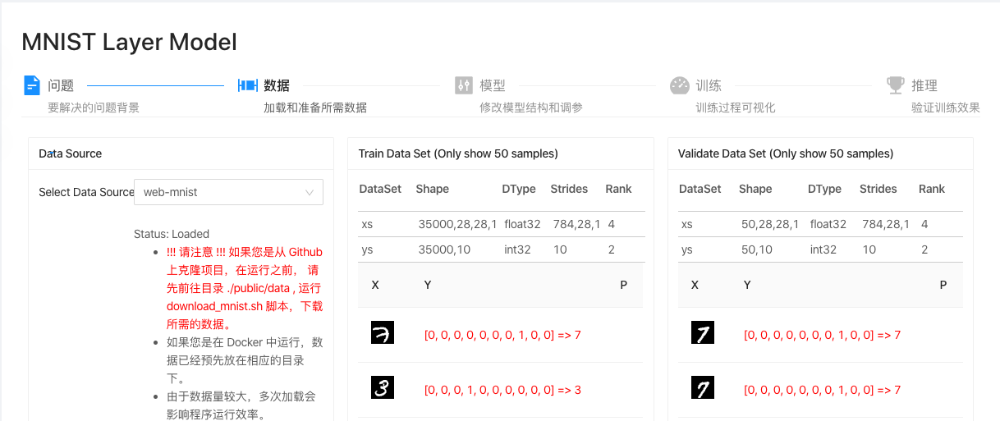
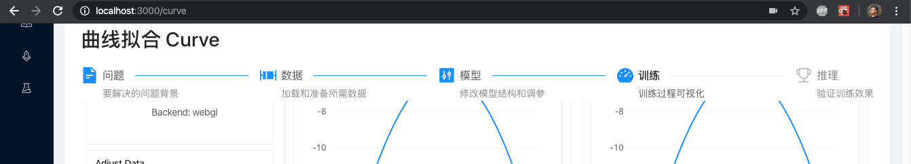

# 展示端到端 AI 概念的舞台

## 端到端的 AI 概念

所谓端到端，就是从领域问题出发，思考所需的数据，运用相应的模型，执行训练，验证推理，形成新应用。这个过程，我自己理解是“从数据出发”的科学探究方法的延伸，就像是古人观测天象、记录物理现象一样。而未来和过去不一样的地方在于，我们可以利用计算机和 AI ，处理更大量的数据，发现隐藏的更深的规律。

在 React-tfjs-camp 的实现中，展示了从 `问题 --> 数据 --> 模型 --> 训练 --> 推理` 的依赖顺序关系。

## AIProcessTabs

为了从视觉上能够展示端到端的前后依赖关系，将 AntD 的 Step 和 Tabs 做了结合，体现为 AIProcessTabs 组件, `/src/components/common/AIProcessTabs.tsx`。

### 带参数的 React 函数组件

AIProcessTabs 比前面介绍的 APP、SiderBar 等组件要复杂些，需要接受上层传递的属性参数。

	import React, { useEffect, useState } from 'react'
	...
	
	export enum AIProcessTabPanes {
	    INFO = '1',
	    DATA = '2',
	    MODEL = '3',
	    TRAIN = '4',
	    PREDICT = '5'
	}
	
	const INVISIBLE_PANES: AIProcessTabPanes[] = []
	
	interface IProps {
	    children?: JSX.Element[]
	
	    title?: string | JSX.Element
	    current?: number
	    invisiblePanes?: AIProcessTabPanes[]
	
	    onChange?: (current: number) => void
	}
	
	const AIProcessTabs = (props: IProps): JSX.Element => {
		...
		const handleChange = (current: number): void => {
	        setCurrent(current)
	        props.onChange && props.onChange(current + 1)
	   }
	}
	
	export default AIProcessTabs

* 使用 interface 能够约束所传递属性的结构。`?` 表示这是个非必须属性。

		interface IProps {
		    children?: JSX.Element[]
		
		    title?: string | JSX.Element
		    current?: number
		    invisiblePanes?: AIProcessTabPanes[]
		
		    onChange?: (current: number) => void
		}

* 使用 `const AIProcessTabs = (props: IProps): JSX.Element => {` 限定传入组件的属性。
* 使用诸如 `props.onChange` 的形式使用属性。由于 `props.onChange` 是非必须的，所以,加上检查条件再使用 `props.onChange && props.onChange(...)`，能够增加代码的鲁棒性。

非常容易理解，不是吗？

### 使用 React Hooks 的 useEffect 处理组件内的数据依赖

我们用 Steps 来展示从 `问题 --> 数据 --> 模型 --> 训练 --> 推理` 的依赖顺序关系。使用 Tabs 容纳每个步骤的具体页面内容。对 Tabs 的子元素 TabPane，我们使用了枚举类型 enum 来限制其关键属性 key 只能使用规定的这五类。

	export enum AIProcessTabPanes {
	    INFO = '1',
	    DATA = '2',
	    MODEL = '3',
	    TRAIN = '4',
	    PREDICT = '5'
	}
	
	...
	
	<TabPane tab='&nbsp;' key={AIProcessTabPanes.INFO}>
		<MarkdownWidget url={'/docs/ai/curve.md'}/>
	</TabPane>

我们想达到的效果是，点击 Steps 中的某一步，能够自动跳转到对应的 TabPane 去。也就是说，Steps 和 Tabs 之间，必须能够保持与内容一致的联动。

AntD 的 Steps 组件的子元素 Step 下标从 `0` 起始，而此时对应的 TabPane 的 key 属性是 `'1'`。为了这个差距，AIProcessTabs 使用了 React Hooks 中另一个重要的 Hook —— useEffect。

	import React, { useEffect, useState } from 'react'
	import { Steps, Tabs } from 'antd'
	...
	
	const { Step } = Steps
		
	const AIProcessTabs = (props: IProps): JSX.Element => {
	    const [sCurrent, setCurrent] = useState<number>(0)
	    const [sInvisiblePanes, setInvisiblePanes] = useState<AIProcessTabPanes[]>(INVISIBLE_PANES)
	
	    useEffect(() => {
	        logger('init current', props.current)
	        props.current && setCurrent(props.current - 1)
	    }, [props.current])
	
	    useEffect(() => {
	        props.invisiblePanes && setInvisiblePanes(props.invisiblePanes)
	    }, [props.invisiblePanes])
	
	    const handleChange = (current: number): void => {
	        setCurrent(current)
	        props.onChange && props.onChange(current + 1)
	    }
	    ...
	
	    return (
	        ...
	                        <Steps current={sCurrent} onChange={handleChange}>
	                            ...
	                        </Steps>
	                    ...	
	            <Tabs activeKey={(sCurrent + 1).toString()} tabBarStyle={{ height: 0 }}>
	                {props.children}
	            </Tabs>
	        ...
	    )
	}
	
	export default AIProcessTabs

`useEffect()` 接受两个参数。第一个参数是一个函数，异步操作的代码放在里面。第二个参数是一个数组，用于给出 Effect 的依赖项，只要这个数组发生变化，useEffect()就会执行。
	
* 使用 useEffect 实现将 Props 参数和组件状态之间的映射。考虑到外部使用此组件时，开发者感知到的是 TabPane 的 key，所以，这个 props.current 参数也是参考 TabPane key 所对应的数值设置。例如：要激活 AIProcessTabPanes.INFO 时，设置此 `props.current = 1`。而进入了组件内部，这个 current 需要影响的是 Steps 的 current 属性，即需要对应 `<Steps current={sCurrent} ...>` 的 `sCurrent = 0`。

		useEffect(() => {
	        logger('init current', props.current)
	        props.current && setCurrent(props.current - 1)
	    }, [props.current])

* `useEffect(() => {...}, [props.current])` 放置于第二个参数 [] 中的部分表示：一旦 props.current 有所变化，执行 useEffect 的函数部分。熟悉 Redux 的读者，立刻会理解这个操作正是 `mapPropsToState` 所做的。
* 如果将第二个参数设置为 `[]` 空数组，则表示仅仅在组件初始化时执行（类似于 React 生命周期函数 componentDidMount）。
* 如果省略第二个参数，每次组件渲染时都会执行useEffect()。

### 处理需要隐藏的 TabPane

在 React-tfjs-camp 的开发过程中，有些 AI 概念内容并不具备完整个五个步骤，所以增加了 `props.invisiblePanes`, 以隐藏相应的 TabPane。在视觉上采用实心图标表示此步为可用，空心图标则不可用。下图显示了在 Mobilenet Calssifier 例子里，由于使用的是预训练模型，不需要展示训练过程。

	import React, { useEffect, useState } from 'react'
	import { Steps, Tabs } from 'antd'
	...
	import {
	    BoxPlotFilled,
	    BoxPlotOutlined,
	    ControlFilled,
	    ControlOutlined,
	    DashboardFilled,
	    DashboardOutlined,
	    FileTextFilled,
	    FileTextOutlined,
	    TrophyFilled,
	    TrophyOutlined
	} from '@ant-design/icons'
	import { logger } from '../../utils'
	
	const { Step } = Steps
	
	export enum AIProcessTabPanes {
	    INFO = '1',
	    DATA = '2',
	    MODEL = '3',
	    TRAIN = '4',
	    PREDICT = '5'
	}
	
	const INVISIBLE_PANES: AIProcessTabPanes[] = []
	
	interface IProps {
	    ...
	    invisiblePanes?: AIProcessTabPanes[]
	    ...
	}
	
	const AIProcessTabs = (props: IProps): JSX.Element => {
	    ...
	    const [sInvisiblePanes, setInvisiblePanes] = useState<AIProcessTabPanes[]>(INVISIBLE_PANES)
	    ...
	
	    useEffect(() => {
	        props.invisiblePanes && setInvisiblePanes(props.invisiblePanes)
	    }, [props.invisiblePanes])
	    ...
	    const getStepProps = (disabled: boolean, iconEnabled: JSX.Element, iconDisabled: JSX.Element): object => {
	        if (disabled) {
	            return { disabled, icon: iconDisabled }
	        } else {
	            return { icon: iconEnabled }
	        }
	    }
	
	    return (
	        ...
	                        <Steps current={sCurrent} onChange={handleChange}>
	                            <Step title='问题' description='要解决的问题背景'
	                                {...getStepProps(sInvisiblePanes?.includes(AIProcessTabPanes.INFO), <FileTextFilled/>, <FileTextOutlined/>)}
	                            />
	                            <Step title='数据' description='加载和准备所需数据'
	                                {...getStepProps(sInvisiblePanes?.includes(AIProcessTabPanes.DATA), <BoxPlotFilled/>, <BoxPlotOutlined/>)}
	                            />
	                            ...
	                        </Steps>
	                    ...

### Sticky 的使用

内容页可能会比较长，有时候会需要向下滚屏。下面的代码展示了使用 Sticky 包裹标题和 Steps，以使 AIProcessTabs 保持在页面顶部。

	import React, { useEffect, useState } from 'react'
	...
	import { Sticky, StickyContainer } from 'react-sticky'
	...
		
	const AIProcessTabs = (props: IProps): JSX.Element => {
	    ...	
	    return (
	        <StickyContainer>
	            <Sticky>{
	                ({ style }) => {
	                    const _style = { zIndex: 1, backgroundColor: 'white', ...style }
	                    return (

	                        <h1>{props.title}</h1>
	                        <Steps current={sCurrent} onChange={handleChange}>
	                            ...
	                        </Steps>
	                    
)
	                }
	            }
	            </Sticky>
	
	            <Tabs activeKey={(sCurrent + 1).toString()} tabBarStyle={{ height: 0 }}>
	                {props.children}
	            </Tabs>
	        </StickyContainer>
	    )
	}
	...

## MarkdownWidget

在 AIProcessTabs 中，问题描述部分会有较多的富文本内容，为了将内容和代码分开，增加了 Markdown 展示组件 MarkdownWidget，`/src/components/common/MarkdownWidget.tsx`。

	import React, { useEffect, useState } from 'react'
	import { message } from 'antd'
	import ReactMarkdown from 'react-markdown'
	import MathJax from '@matejmazur/react-mathjax'
	import RemarkMathPlugin from 'remark-math'
	
	import { fetchResource, logger } from '../../utils'
	
	const DEFAULT_INFO = 'Please set props url or source'
	
	const loadMD = async (url: string): Promise<string> => {
	    const buffer = await fetchResource(url, false)
	    return buffer.toString()
	}
	
	const math = (p: {value: string}): JSX.Element => {
	    return <MathJax.Node>{p.value}</MathJax.Node>
	}
	
	const inlineMath = (p: {value: string}): JSX.Element => {
	    return <MathJax.Node inline>{p.value}</MathJax.Node>
	}
	
	const renderers = {
	    math, inlineMath
	}
	
	interface IProps {
	    source?: string
	    url?: string
	    imgPathPrefix?: string
	}
	
	const MarkdownWidget = (props: IProps): JSX.Element => {
	    const [sSource, setSource] = useState<string>(DEFAULT_INFO)
	
	    useEffect(() => {
	        if (!props.url) {
	            return
	        }
	        logger('Load MD from url: ', props.url)
	
	        // Fetch and load MD content
	        loadMD(props.url).then(
	            (src) => {
	                const prefix = props.imgPathPrefix ?? '/docs'
	                const _src = src.replace(/.\/images/g, `${prefix}/images`)
	                setSource(_src)
	            }, (e) => {
	                // eslint-disable-next-line @typescript-eslint/no-floating-promises
	                message.error(e.message)
	            })
	    }, [props.url])
	
	    useEffect(() => {
	        props.source && setSource(props.source)
	    }, [props.source])
	
	    return (
	        <MathJax.Context>
	            <ReactMarkdown source={sSource} escapeHtml={true} plugins={[RemarkMathPlugin]} renderers={renderers}/>
	        </MathJax.Context>
	    )
	}
	
	export default MarkdownWidget

* source 属性，直接渲染 source 属性中的 MD 文本串。

		import React, { useEffect, useState } from 'react'
		import ReactMarkdown from 'react-markdown'
		...
		
		const MarkdownWidget = (props: IProps): JSX.Element => {
			const [sSource, setSource] = useState<string>(DEFAULT_INFO)
			...
			useEffect(() => {
		        props.source && setSource(props.source)
		   	}, [props.source])
		    ...
		    return (
		        <MathJax.Context>
		            <ReactMarkdown source={sSource} escapeHtml={true} .../>
		        </MathJax.Context>
		    )
		}

* url 属性，下载网络 MD 文件进行渲染，会覆盖 source 属性。如果无法加载 url 资源，返回错误消息。此处用到的 `fetchResource` 函数，起到的作用就是从 URL 获取相应的文件，稍后再介绍。

		const loadMD = async (url: string): Promise<string> => {
		    const buffer = await fetchResource(url, false)
		    return buffer.toString()
		}
		...
	   	
		   	useEffect(() => {
		        if (!props.url) {
		            return
		        }
		        logger('Load MD from url: ', props.url)
		
		        // Fetch and load MD content
		        loadMD(props.url).then(
		            (src) => {
		                ...
		                setSource(_src)
		            }, (e) => {
		                // eslint-disable-next-line @typescript-eslint/no-floating-promises
		                message.error(e.message)
		            })
		    }, [props.url])

* 对嵌入图片链接进行处理，使之能够在 React-tfjs-camp 中正常加载，并且能够在 github 上正常显示。将文档中的图片链接相对地址 `../images`，映射成 Web APP 中的绝对地址 `/docs/images`。

		loadMD(props.url).then(
            (src) => {
                const prefix = props.imgPathPrefix ?? '/docs'
                const _src = src.replace(/.\/images/g, `${prefix}/images`)
                setSource(_src)
            }, (e) => {
                // eslint-disable-next-line @typescript-eslint/no-floating-promises
                message.error(e.message)
            })
            
* 支持使用 Latex 描述公式。`react-markdown` 支持使用 Latex 插件，以显示 Latex 公式。不过当前这个实现很老旧了，在页面切换时，有时会显示不出来。受实现所限，仅能支持 `$$` 形式的 Latex， 例如：`$$ relu(x) = max(0, x) $$`。如果以后找到更好的实现，再替换一下。

		import React, { useEffect, useState } from 'react'
		import ReactMarkdown from 'react-markdown'
		import MathJax from '@matejmazur/react-mathjax'
		import RemarkMathPlugin from 'remark-math'
		...
				
		const math = (p: {value: string}): JSX.Element => {
		    return <MathJax.Node>{p.value}</MathJax.Node>
		}
		
		const inlineMath = (p: {value: string}): JSX.Element => {
		    return <MathJax.Node inline>{p.value}</MathJax.Node>
		}
		
		const renderers = {
		    math, inlineMath
		}
		...
		
		const MarkdownWidget = (props: IProps): JSX.Element => {
		    ...
		
		    return (
		        <MathJax.Context>
		            <ReactMarkdown source={sSource} escapeHtml={true} plugins={[RemarkMathPlugin]} renderers={renderers}/>
		        </MathJax.Context>
		    )
		}
		...
		
