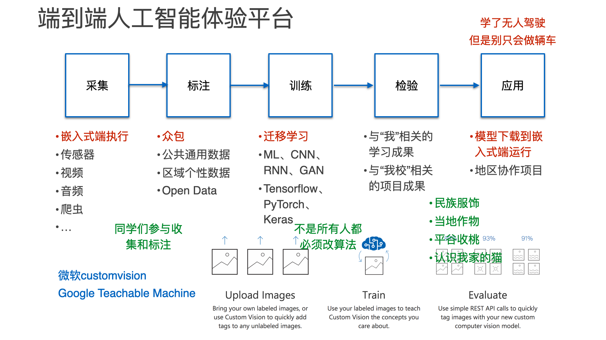

# 搭建展示端到端 AI 概念的舞台

## 端到端的 AI 概念

所谓端到端，就是从领域问题出发，思考所需的数据，运用相应的模型，执行训练，验证推理，形成新应用。这个过程，我自己理解是“从数据出发”的科学探究方法的延伸，就像是古人观测天象、记录物理现象一样。而未来和过去不一样的地方在于，我们可以利用计算机和 AI ，处理更大量的数据，发现隐藏的更深的规律。

从这个起点出发，甄选了一些 AI 学习的例子，初步形成了当前的框架。

