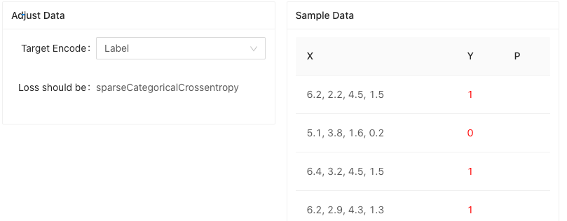
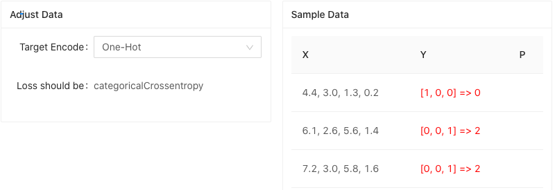

# 用 Tensorflow.js 处理按数据分类问题

## 分类问题的数据表述

鸢尾花原始的数据，类似这样：

	4.8,3.0,1.4,0.3,Iris-setosa
	5.1,3.8,1.6,0.2,Iris-setosa
	4.6,3.2,1.4,0.2,Iris-setosa
	5.7,3.0,4.2,1.2,Iris-versicolor
	5.7,2.9,4.2,1.3,Iris-versicolor
	6.2,2.9,4.3,1.3,Iris-versicolor
	6.3,3.3,6.0,2.5,Iris-virginica
	5.8,2.7,5.1,1.9,Iris-virginica
	7.1,3.0,5.9,2.1,Iris-virginica

为了便于计算处理，需要对分类结果进行转换处理。

常见的处理分类目标数据的方法有：标签编码 和 One-Hot

### 标签编码

使用 int 类型, 对三种分类进行编号替换，就形成了整数标签目标数据：

* 0 ：Iris setosa（山鸢尾）
* 1 ：Iris versicolor（杂色鸢尾）
* 2 ：Iris virginica（维吉尼亚鸢尾）

上面的数据被转换成（为了便于观察，在数据中增加了空格，以区分特征数据和目标分类数据）：

	4.8,3.0,1.4,0.3, 0
	5.1,3.8,1.6,0.2, 0
	4.6,3.2,1.4,0.2, 0
	5.7,3.0,4.2,1.2, 1
	5.7,2.9,4.2,1.3, 1
	6.2,2.9,4.3,1.3, 1
	6.3,3.3,6.0,2.5, 2
	5.8,2.7,5.1,1.9, 2
	7.1,3.0,5.9,2.1, 2

标签编码的类别值从0开始（因为大多数计算机系统如此计数），所以，如果有N个类别，类别值为 0 至 N-1 的。

鸢尾花数据量不大，直接按照整数标签编码，在代码中定义为一个多维数组。

	export const IRIS_RAW_DATA = [
	    [5.1, 3.5, 1.4, 0.2, 0], [4.9, 3.0, 1.4, 0.2, 0], [4.7, 3.2, 1.3, 0.2, 0],
	    [4.6, 3.1, 1.5, 0.2, 0], [5.0, 3.6, 1.4, 0.2, 0], [5.4, 3.9, 1.7, 0.4, 0],
	    [4.6, 3.4, 1.4, 0.3, 0], [5.0, 3.4, 1.5, 0.2, 0], [4.4, 2.9, 1.4, 0.2, 0],
	    ...
	    [6.9, 3.1, 5.1, 2.3, 2], [5.8, 2.7, 5.1, 1.9, 2], [6.8, 3.2, 5.9, 2.3, 2],
	    [6.7, 3.3, 5.7, 2.5, 2], [6.7, 3.0, 5.2, 2.3, 2], [6.3, 2.5, 5.0, 1.9, 2],
	    [6.5, 3.0, 5.2, 2.0, 2], [6.2, 3.4, 5.4, 2.3, 2], [5.9, 3.0, 5.1, 1.8, 2]
	]

**标签编码的适用场景**：

* 如果原本的标签编码是有序意义的，例如评分等级，使用标签编码就是一个更好的选择。
* 不过，如果标签编码是和鸢尾数据类似的无顺序数据，在计算中，更高的标签数值会给计算带来不必要的附加影响。这时候更好的方案是使用 one-hot 编码方式。

在上面的数据中。在进行标签编码的数据集中有

$$ virginica(2) > versicolor(1) > setosa(0) $$

比方说，假设模型内部计算平均值（神经网络中有大量加权平均运算），那么0 + 2 = 2，2 / 2 = 1. 这意味着：virginica 和 setosa 平均一下是 versicolor。如果不对Loss 函数作些变化，该模型的预测也许会有大量误差。

### One-Hot

One-Hot 编码是将类别变量转换为机器学习算法易于利用的一种形式的过程。One-Hot 将 n 个分类，表示为一个 只含有 0，1 数值的向量。向量的位置表示了对应的分类。

例如，采用 One-Hot 编码，上面的数据就应该编码成：

	4.8,3.0,1.4,0.3, [1,0,0]
	5.1,3.8,1.6,0.2, [1,0,0]
	4.6,3.2,1.4,0.2, [1,0,0]
	5.7,3.0,4.2,1.2, [0,1,0]
	5.7,2.9,4.2,1.3, [0,1,0]
	6.2,2.9,4.3,1.3, [0,1,0]
	6.3,3.3,6.0,2.5, [0,0,1]
	5.8,2.7,5.1,1.9, [0,0,1]
	7.1,3.0,5.9,2.1, [0,0,1]
	
tfjs 里也提供了将标签编码转化成 One-Hot 的函数 `tf.oneHot`，使用起来很方便。

## 构造训练集和测试集

### 按比例分配数据集

	export const splitDataSet = (shuffled: IArray, testSplit: number, shuffle = false): IArray[] => {
	    if (shuffle) {
	        tf.util.shuffle(shuffled)
	    }
	
	    const totalRecord = shuffled.length
	    // Split the data into training and testing portions.
	    const numTestExamples = Math.round(totalRecord * testSplit)
	    const numTrainExamples = totalRecord - numTestExamples
	
	    const train = shuffled.slice(0, numTrainExamples)
	    const test = shuffled.slice(numTrainExamples)
	
	    return [train, test]
	}

* 利用 ES6 的数组函数 `Array.slice()` 简单粗暴的按照数组下标将原始数据分拆成训练集和测试集。
* `tf.util.shuffle` 被用于打乱数组数据的顺序。这是在做数据处理时经常用到的方法。

> ES6 里还有个很形似 `Array.slice()` 的函数，`Array.splice()`，不小心的话容易混淆，需要注意区分一下。
> 
> * slice()方法返回数组中被选中的元素，作为一个新的数组对象。splice()方法返回数组中被删除的项。
* slice()方法不改变原来的数组，而splice()方法改变了原来的数组。
* slice()方法可以接受2个参数。splice()方法可以接受n个参数。

### 了解 tf.data.Dataset

有两种方法可以训练LayersModel ：

* 使用 `model.fit()` 并将数据作为一个大张量提供。
* 使用 `model.fitDataset()` 并通过 Dataset 对象提供数据.

在 Curve 的例子中，我们已经使用 Tensor 作为数据，对模型进行了训练。如果您的数据集能够被放进内存，并且可以作为单个张量使用，则可以通过调用 fit() 方法来训练模型。

而如果数据不能完全放入内存或正在流式传输，则可以通过使用 Dataset 对象的 fitDataset() 来训练模型. 

Dataset 表示一个有序的元素集合对象，这个对象能够通过链式方法完成一系列加载和转换，返回另一个 Dataset。数据加载和转换是以一种懒加载和流的方式完成。数据集可能会被迭代多次；并且每次迭代都会从头开始进行。例如：

	const processedDataset = rawDataset.filter(...).map(...).batch(...)
	
下面的代码被用于生成鸢尾花的 DataSet，来自 `./src/components/iris/data.ts`。

	export const getIrisData = (testSplit: number, isOntHot = true,
	    shuffle = true): Array<tf.data.Dataset<tf.TensorContainer>> => {
	    // Shuffle a copy of the raw data.
	    const shuffled = IRIS_RAW_DATA.slice()
	    const [train, test] = splitDataSet(shuffled, testSplit, shuffle)
	
	    // Split the data into into X & y and apply feature mapping transformations
	    const trainX = tf.data.array(train.map(r => r.slice(0, 4)))
	    const testX = tf.data.array(test.map(r => r.slice(0, 4)))
	
	    let trainY: tf.data.Dataset<number[]>
	    let testY: tf.data.Dataset<number[]>
	
	    if (isOntHot) {
	        trainY = tf.data.array(train.map(r => flatOneHot(r[4])))
	        testY = tf.data.array(test.map(r => flatOneHot(r[4])))
	    } else {
	        trainY = tf.data.array(train.map(r => [r[4]]))
	        testY = tf.data.array(test.map(r => [r[4]]))
	    }
	
	    // Recombine the X and y portions of the data.
	    const trainDataset = tf.data.zip({ xs: trainX, ys: trainY })
	    const testDataset = tf.data.zip({ xs: testX, ys: testY })
	
	    return [trainDataset, testDataset]
	}

* 将每条鸢尾花数据的前四个元素作为 X。

	    // Split the data into into X & y and apply feature mapping transformations
	    const trainX = tf.data.array(train.map(r => r.slice(0, 4)))
	    const testX = tf.data.array(test.map(r => r.slice(0, 4)))

* Y 则根据所使用的编码方式而发生变化。

		if (isOntHot) {
	        trainY = tf.data.array(train.map(r => flatOneHot(r[4])))
	        testY = tf.data.array(test.map(r => flatOneHot(r[4])))
	    } else {
	        trainY = tf.data.array(train.map(r => [r[4]]))
	        testY = tf.data.array(test.map(r => [r[4]]))
	    }

* 将整数标签编码转换成 OneHot 编码的函数如下。

		export const flatOneHot = (idx: number): number[] => {
		    return Array.from(tf.oneHot([idx], 3).dataSync())
		}

### 初始化数据集

我们需要根据用户选择的 sTargetEncode 更新训练和测试数据集，这样的代码，放在 useEffect 里很适合，来自 `./src/components/iris/Iris.tsx`。

    useEffect(() => {
        if (!sTargetEncode) {
            return
        }
        logger('encode dataset ...')

        const isOneHot = sTargetEncode === ONE_HOT
        const [tSet, vSet] = data.getIrisData(VALIDATE_SPLIT, isOneHot)

        // Batch datasets.
        setTrainSet(tSet.batch(BATCH_SIZE))
        setValidSet(vSet.batch(BATCH_SIZE))
        
        ...
    }, [sTargetEncode])

* 这里有个前面强调过的知识点，Dataset.batch 会在最后训练发生时，才会去迭代执行，产生数据片段。

### SampleDataVis 展示数据样本

为了便于观察数据样本，构造了 SampleDataVis 组件，来自 `./src/components/common/tensor/SampleDataVis.tsx`。

#### 使用 useEffect 构建细粒度的数据驱动渲染

在 `SampleDataVis.tsx` 中，我们设计了如下的数据变化 useEffect，以避免不必要的 UI 渲染：

1. [] => SampleDataVis 组件创建时，创建 AntD Table 的数据列，这个操作只做一次。

2. 展示太多数据，对我们了解数据集情况意义不大。因此，属性数据 props.*Dataset 变化时，我们仅取出 sSampleCount 个数据用于显示。

	* [props.xDataset, sSampleCount] => 因此，属性数据 props.xDataset 变化时，仅取出 sSampleCount 个数据用于显示，将取出的数据结果放在 xData 中。
	* [props.yDataset, sSampleCount] , [props.pDataset, sSampleCount] => 和 props.xDataset 处理类似，多一步将计算出的 OneHot 向量转化为 Label 的步骤，便于在显示是对比 Predict 值是否正确。

3. 	SampleDataVis 组件内部的数据按需渲染。

	* [xData, yData] => 有变化时，及时渲染。
	* [pData] => 每一次使用模型进行 Predict 之后，都会更改 props.pDataset 数据，引起 pData 的变化。而此时 props.xDataset、props.yDataset 并不变化。所以我们只修改 pData 的显示即可，不必重复渲染 xData， yData。

#### AntD Table 的使用

SampleDataVis 组件使用 AntD Table 进行数据显示。

* 如果 Y 数据是 Label，会直接显示数值。

	

* 如果 Y 数据是 OneHot，则显示 OneHot 数组以及对应的 Label。

	

下面的代码展示了 AntD 中 Table 的用法，通过构建 columns 数组来描述每列的数据及其渲染，其中每一行展示的数据格式如 interface IDataRecord 的定义。

	interface IDataRecord {
	    key: number
	    x: tf.Tensor
	    y: tf.Tensor
	    p?: tf.Tensor
	    yLabel?: string
	    pLabel?: string
	}
	...

	useEffect(() => {
	        const _columns = [
	            {
	                title: 'X',
	                dataIndex: 'x',
	                render: (text: string, record: tf.TensorContainerObject): JSX.Element => {
	                    return {formatX(record.x as tf.Tensor)}
	                }
	            },
	            {
	                title: 'Y',
	                dataIndex: 'y',
	                render: (text: string, record: tf.TensorContainerObject): JSX.Element => {
	                    const yArray = formatTensorToStringArray(record.y as tf.Tensor, 0)
	                    const yStr = yArray.length > 1 ? `[${yArray.join(', ')}] => ${record.yLabel}` : yArray.join(', ')
	                    const color = record.yLabel === record.pLabel ? 'green' : 'red'
	                    return {yStr}
	                }
	            },
	            {
	                title: 'P',
	                dataIndex: 'p',
	                render: (text: string, record: tf.TensorContainerObject): JSX.Element => {
	                    const pArray = formatTensorToStringArray(record.p as tf.Tensor, 2)
	                    const pStr = pArray.length > 1 ? `[${pArray.join(', ')}] => ${record.pLabel}` : pArray.join(', ')
	                    const color = record.yLabel === record.pLabel ? 'green' : 'red'
	                    return pStr ? {pStr} : <></>
	                }
	            }]
	        setColumns(_columns)
	    }, [])
	    
	...
	    
	return (
        

        	...
            <Table columns={columns} dataSource={sData as object[]} pagination={{ pageSize: props.pageSize ?? DEFAULT_PAGE_SIZE }}/>
        

    )

让我们来看看，列的数据是如何展示的。

				{
	                title: 'X',
	                dataIndex: 'x',
	                render: (text: string, record: tf.TensorContainerObject): JSX.Element => {
	                    return {formatX(record.x as tf.Tensor)}
	                }
	            },

* `dataIndex` 为列数据在 IDataRecord 数据项中对应的路径，支持通过数组查询嵌套路径。
* `render` 生成复杂数据的渲染函数，参数分别为当前行的值，当前行数据，行索引，@return 里面可以设置表格行/列合并。`Function(text, record, index) {}`

更多 AntD Table 的信息请参考 [https://ant.design/components/table-cn/](https://ant.design/components/table-cn/)

## 全联接网络模型

鸢尾花分类采用全联接网络，参考代码实现如下。其中激活函数、输入层的神经元数量都可以在页面上直接调整。

	const model = tf.sequential()
	model.add(tf.layers.dense({
		units: sDenseUnits,
		activation: sActivation as any,
		inputShape: [data.IRIS_NUM_FEATURES]
	}))
	model.add(tf.layers.dense({ units: 3, activation: 'Softmax' }))

* 输入层的 inputShape 是和特征数据相关的，是个 4 元向量。
* 因为要输出三个分类，所以输出层的神经元数量设置为 3。
* 多分类问题的输出层，激活函数使用 Softmax。如果是二分类问题，激活函数可以使用 Sigmoid。
* `sActivation` 激活函数可以选择 `['sigmoid', 'relu', 'tanh']`, 感受一下不同激活函数对于分类的影响。
* `sDenseUnits` 全联接网络的神经元数量可调。

## 训练

### 调整训练参数：注意一下 Loss 函数

调整训练参数，体会一下对于训练过程有什么影响。

    useEffect(() => {
        if (!sModel || !sLearningRate || !sOptimizer || !sLoss) {
            return
        }
        logger('init optimizer ...')

        let optimizer: tf.Optimizer
        switch (sOptimizer) {
            case 'SGD' :
                optimizer = tf.train.sgd(sLearningRate)
                break
            case 'RMSProp' :
                optimizer = tf.train.rmsprop(sLearningRate)
                break
            case 'Adam' :
            default:
                optimizer = tf.train.adam(sLearningRate)
                break
        }

        sModel.compile({ optimizer: optimizer, loss: sLoss, metrics: ['accuracy'] })
        // setModel(model)

        return () => {
            logger('Optimizer Dispose')
            optimizer?.dispose()
        }
    }, [sModel, sLearningRate, sOptimizer, sLoss])

* sLearningRate 调整。
* sOptimizer 训练时的优化器可以选择 `['SGD', 'Adam', 'RMSProp']` 三种算法
* sLoss 必须要注意一下，这个 Loss 函数的选择是和目标数据编码方式相关的。
	* 如果选择 Label 编码，则需要使用 `sparseCategoricalCrossentropy`，
	* 如果选择 OneHot 编码，则需要使用 `categoricalCrossentropy`

### 使用 Model.fitDataset 训练

		const beginMs = performance.now()
		model.fitDataset(trainDataset, {
            epochs: EPOCHS,
            validationData: validDataset,
            callbacks: {
                onEpochEnd: async (epoch, logs) => {
                    logger('onEpochEnd', epoch)

                    logs && addTrainInfo({ iteration: epoch, logs })
                    predictModel(model, sPredictSet?.xs)
                    await tf.nextFrame()
                },
                onBatchEnd: async () => {
                    if (stopRef.current) {
                        logger('onBatchEnd Checked stop', stopRef.current)
                        setStatus(STATUS.STOPPED)
                        model.stopTraining = stopRef.current
                    }
                    await tf.nextFrame()
                }
            }
        }).then(
            () => {
                setStatus(STATUS.TRAINED)

                const secPerEpoch = (performance.now() - beginMs) / (1000 * EPOCHS)
                logger(secPerEpoch)
            },
            loggerError
        )

### 展示训练过程 —— 在 useState 中使用数组 

在 onEpochEnd 或 onBatchEnd 回调函数被调用时，可以得到当前训练的 logs 信息，结合我们在上一张中使用过的 BizChart 工具，可以自己定义训练过程的展示组件  HistoryWidget。HistoryWidget 的实现和画曲线类似，不做过多赘述。

不过，这一次和以前使用 useState 的场景略有不一样，需要注意一下。先看看代码：

	const [sTrainInfos, setTrainInfos] = useState<ITrainInfo[]>([])
	
	const addTrainInfo = (info: ITrainInfo): void => {
       sTrainInfos.push(info)
       setTrainInfos([...sTrainInfos])
    }
    
    ...
    <HistoryWidget infos={sTrainInfos} totalIterations={EPOCHS}/>

你发现了没有？我们在 useState 时定义了一个**数组**。而且，当我们在往 sTrainInfos 里 push 数据时，还增加了一个**看似无用**的 `setTrainInfos([...sTrainInfos])` 语句。

你可以去掉它试试，会发现 log 数据就显示不出来了。这是因为React Hooks 函数组件每次因刷新渲染而被调用时，都会重新创建内部的对象。因此，在这里只能再次强行赋值一遍。