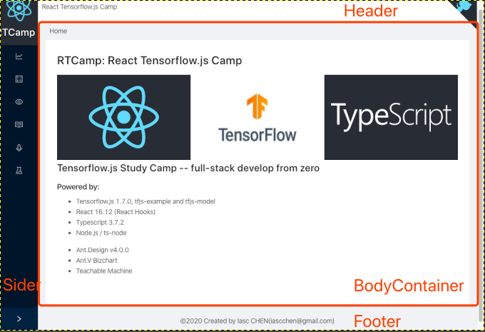

# 构建开发框架

在上一篇中，我们使用 React-Scripts 创建了一个新的 React APP。现在开始装修改造。

## React-tfjs-camp 的目录结构

React-tfjs-camp 对目录结构作了如下调整：

	.
	|____.eslintrc.js		使用 eslint 进行代码格式检查的配置文件 
	|____.git
	|____.gitignore
	|____README.md
	|____LICENSE			此项目使用 MIT LICENSE 的说明
	|____node_modules
	|____yarn.lock
	|____package.json
	|____tsconfig.json
	|____public				静态资源目录
	|____src				Web APP 代码目录
	|____node				Node.js 代码目录
	|____Dockerfile			用于构建 Docker Image
	|____docker_build.sh	Docker 构建脚本 
	|____docker_run.sh		Docker 运行脚本

### public 目录结构

	.
	|____favicon.ico
	|____index.html
	|____404.html
	|____manifest.json
	|____robots.txt
	|____images				根目录的静态图片目录
	|____docs				文档目录
	| |____images			文档所使用的图片
	| |____ai				AI Concept 相关文档
	| |____dev				Develop Tutorial 相关文档
	|____model				用户通过 Web App 或者 Node.js 训练后的模型，可以拷贝到这里，供下次使用
	|____data				用户代码中使用的个性化数据，可以放置在此处，供下次加载使用
	|____preload			项目使用的各种数据集和预训练模型文件，下载一次之后，减少不必要的网络延迟
	| |____model
	| | |____download_model.sh		下载模型的脚本
	| |____data
	| | |____download_data.sh		下载数据集的脚本

### src 目录结构

	.
	|____index.tsx				React 入口，整个项目的 Web 渲染由此开始
	|____index.css		
	|____App.tsx				App Root 组件
	|____App.css				App 组件相关格式 css
	|____serviceWorker.ts		Service Worker 相关，未修改
	|____routers.ts				使用 React-Router 集中处理页面路由
	|____constant.ts			一些常量
	|____utils.ts				一些工具常数和函数
	|____App.test.tsx			APP Unit Test 入口，未修改
	|____setupTests.ts			未修改
	|____components				主要代码在这里，定义了 Web APP 所用到的页面组件
	| |____common
	| | |____visulization
	| | |____tensor
	| | |____tfvis
	| |____curve
	| |____iris
	| |____mnist
	| |____mobilenet
	| |____rnn
	| |____pretrained
	|____react-app-env.d.ts		一些没有声明类型的 npm 包，需要放在这里，才可以被 Typescript 正确编译
	|____typescript_logo.svg
	|____react_logo.svg
	
### node 目录结构
	.
	|____README.md
	|____package.json			使用 Node.js 代码的 Package.json
	|____tsconfig.json			使用 Node.js 代码的 Typescript 语法特性设置
	|____node_modules
	|____src					Node.js 代码目录
	| |____jena
	| |____sentiment
	| |____simpleObjDetector
	| |____textGenLstm
	| |____utils.ts				一些工具常数和函数
	|____logs					用于存放训练产生的 logs

## 规范代码语法和风格检查

这部分内容非常重要，不过却往往被各种开发教程忽略，可以让我们避免使用在 JS 中广受诟病的那些陈旧语法和奇技淫巧，提高代码的可读性，减少代码的漏洞。

### tsconfig.json

使用 tsconfig.json 对 Typescript 语法特性设置。这个文件会在使用 `tsc` 进行  TypeScript 语法检查和编译时起作用。

在 React-tfjs-camp 的 Web APP 中，使用了 React 和 ES6 语法特性，设置如下。其中 `...` 略去的部分主要对代码格式进行规范化限制的部分。简单来说，这些设置使得我们能够使用诸如：import/export、箭头函数、async/await 等较新的 JS 语法。

	{
	    "compilerOptions": {
	        "allowJs": false,
	        "module": "esnext",
	        "jsx": "react",
	        "target": "es6",
	        "lib": [
	            "dom",
	            "dom.iterable",
	            "es6",
	            "es7",
	            "esnext"
	        ],
			...
	    },
	    "include": [
	        "src"
	    ],
	    "exclude": [
	        "node_modules"
	    ]

针对于 Node.js 的代码，使用的配置有如下修改：

	{
	    "compilerOptions": {
	        "allowJs": true,
	        "module": "commonjs",
	        "target": "es6",
	        ...
	}
	
### .eslintrc.js

.eslintrc.js 是 eslint 的配置文件，被用于进行代码风格检查，在开发的 IDE 中使用。下面的设置，集成了常用的 Typescript、React 推荐代码风格检查规则。

在一些文档中，你还会看到使用 tslint 进行 Typescript 的代码检查。当前，Typescript 官方已经推荐使用的是 eslint。

	module.exports = {
	    root: true,
	    parser: '@typescript-eslint/parser',
	    plugins: [
	        '@typescript-eslint', "react", 'react-hooks', 'eslint-comments'
	    ],
	    extends: [
	        "react-app",
	        'eslint:recommended',
	        'plugin:@typescript-eslint/eslint-recommended',
	        'plugin:@typescript-eslint/recommended',
	        "plugin:react/recommended",
	        'standard-with-typescript',
	    ],
	    parserOptions: {
	        project: "./tsconfig.json",
	        sourceType:  'module',  // Allows for the use of imports
	    },
	    rules: {
	        "react-hooks/rules-of-hooks": "error",
	        "react-hooks/exhaustive-deps": "warn",
	        "@typescript-eslint/interface-name-prefix": ["error", {"prefixWithI": "always"}],
	        "@typescript-eslint/indent": ["error", 4, { 'SwitchCase': 1 }],
	        "jsx-quotes": ["error", "prefer-single"],
	        '@typescript-eslint/no-unused-vars': ['error', {
	            'vars': 'all',
	            'args': 'none',
	            'ignoreRestSiblings': true,
	        }],
	        "@typescript-eslint/strict-boolean-expressions": 0,
	    },
	    settings:  {
	        react:  {
	            version:  'detect',  // Tells eslint-plugin-react to automatically detect the version of React to use
	        },
	    }
	};

## 使用 Ant Design 构建页面框架

### Ant Design

Ant Design 是蚂蚁金服体验技术部经过大量项目实践和总结，逐步打磨出的一个服务于企业级产品的设计体系。如果您对于交互界面没有特殊的 VI 设计要求，使用 AntD 能够非常快的开发出交互界面。在实际应用中，AntD 常常被用于 Web 应用的管理后台开发。

Ant Design 4 于 2020 年的 2 月 28 日正式发布，当前(码字时)版本已经升级到 4.1.2 了。Ant Design 4 有较大的提升，最重要的更新在于全面支持 React Hooks，重写了Form、Table 等关键组件，使用起来代码优美了不少。

AntD 的文档非常易于理解和使用。参考链接 [https://ant.design/index-cn](https://ant.design/index-cn)

参照 AntD 的官方文档，很快就能够搭出 React-tfjs-camp 的页面框架。

### 在项目中使用 AntD

在项目根目录中，执行以下命令，安装 AntD 包。安装完成之后，package.json 中会自动增加 `"antd": "^4.1.2",` 的依赖包条目。

	$ yarn add antd

打开 `/src/index.tsx`, 在文件头部的声明部分增加 antd.css，以使用 AntD 定义的页面风格资源。

	import 'antd/dist/antd.css'
	
在需要的页面 import 所需使用 AntD 组件即可。

	import { ... } from 'antd'
	
### 改造 App.tsx

App.tsx 是 React App 中常用的根页面组件。

####  页面布局

使用 AntD 的 Layout 组件，能够帮助我们非常容易的构建出各种结构的应用框架。React-tfjs-camp 采用左右结构的页面布局，如下图所示。

左侧的菜单条被封装在 SideBar 里，页面主体被封装在 BodyContainer 里。修改 App.tsx 如下：

	import React, { useState } from 'react'
	import { Layout } from 'antd'
	
	import './App.css'
	import SideBar from './components/common/SideBar'
	import BodyContainer from './components/common/BodyContainer'
	import GitHubLogo from './components/common/GitHubLogo'
	
	const { Header, Sider, Footer } = Layout
	
	const App = (): JSX.Element => {
	    const [sCollapsed, setCollapsed] = useState(true)
	
	    const onCollapse = (): void => {
	        setCollapsed(collapsed => !collapsed)
	    }
	
	    return (
	        <Layout>
	            ...
	                <Sider collapsible collapsed={sCollapsed} onCollapse={onCollapse}>
	                    <SideBar/>
	                </Sider>
	                <Layout className='site-layout'>
	                    <Header style={{ background: '#fff', padding: '0' }}>
	                        React Tensorflow.js Camp
	                        <GitHubLogo/>
	                    </Header>
	                    ...
	                        <BodyContainer/>
	                    ...
	                    <Footer style={{ textAlign: 'center' }}>©2020 Created by Iasc CHEN(iascchen@gmail.com)</Footer>
	                </Layout>
	            ...
	        </Layout>
	    )
	}
	
	export default App

## 边栏菜单和页面导航

### React-Route 

### 面包屑和页面组件渲染

### 使用 React Hooks 管理边栏状态

## ErrorBoundary