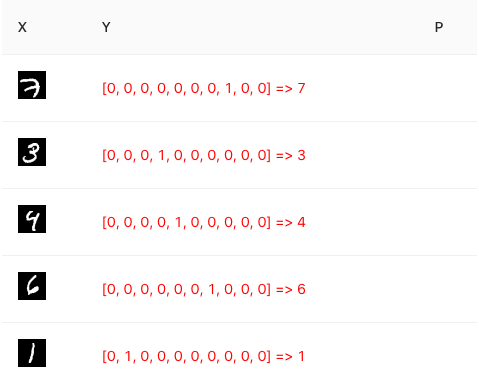

# MNIST CNN 的 Layer Model 实现

## MNIST 的数据集

### MNIST 的数据集的两种格式—— PNG 和 GZ

MNIST 的数据集有以下两种格式：

* GZ 格式数据集：将训练集、测试集，以及它们各自的标注，分别存放在 gz 压缩文件中。需要下载并展开后方能使用。Python、Node.js 中使用这种格式比较方便。
* PNG 格式数据集：将所有的小图片都合成到一个大的 PNG 图片中，便于 Web 端加载。在浏览器端使用此格式更方便。

React-tfjs-camp 实现了对这两种格式数据的处理，将 Mnist 数据集封装在 `interface IMnistDataSet` 中。

	import { TensorContainerObject } from '@tensorflow/tfjs'
	
	export const IMAGE_H = 28
	export const IMAGE_W = 28
	export const IMAGE_SIZE = IMAGE_H * IMAGE_W
	export const NUM_CLASSES = 10
	
	export interface IMnistDataSet {
	    loadData: () => Promise<void>
	    getTrainData: (numExamples?: number) => TensorContainerObject
	    getTestData: (numExamples?: number) => TensorContainerObject
	
	    nextTrainBatch: (batchSize: number) => TensorContainerObject
	    nextTestBatch: (batchSize: number) => TensorContainerObject
	}

* TensorContainerObject 是封装 Tensor 常用的方式，其形式为 Json。
* getTrainData 和 getTestData，用于 tfjs LayerModel 形式的 model.fit 训练。
* nextTrainBatch 和 nextTestBatch 被用于 tfjs core API 形式的训练。

使用 useEffect 在用户修改数据集时，进行相应加载的 useEffect 如下，用完数据及时使用 tf.dispose 释放是个好习惯。

    useEffect(() => {
        logger('init data set ...')

        setStatus(STATUS.WAITING)

        let mnistDataset: IMnistDataSet
        if (sDataSourceName === 'mnist' || sDataSourceName === 'fashion') {
            mnistDataset = new MnistDatasetGz(sDataSourceName)
        } else {
            mnistDataset = new MnistDatasetPng()
        }

        let tSet: tf.TensorContainerObject
        let vSet: tf.TensorContainerObject
        mnistDataset.loadData().then(
            () => {
                tSet = mnistDataset.getTrainData()
                vSet = mnistDataset.getTestData(SHOW_SAMPLE)

                setTrainSet(tSet)
                setTestSet(vSet)

                setStatus(STATUS.LOADED)
            },
            loggerError
        )

        return () => {
            logger('Data Set Dispose')
            tf.dispose([tSet.xs, tSet.ys])
            tf.dispose([vSet.xs, vSet.ys])
        }
    }, [sDataSourceName])

### 预先下载数据集到本地

要完成 MNIST 实验，需要下载对应的数据集。在国内下载速度比较慢（或者需要科学上网），为了减少不必要的等待，我们先将这些数据集下载到本地，以便多次使用。

在命令行中使用以下命令，下载数据。

	$ cd ./public/preload/data
	$ ./download_mnist_data.sh

如果不能执行的话，请检查一下系统是否已经安装 `wget` 。

### PNG 格式数据的加载和使用

PNG 格式数据加载的主要代码请参考 `./src/components/mnist/MnistDatasetPng.ts`。

* 所依赖的数据集需要预先被下载到 `/preload/data/mnist` 目录下。

		const BASE_URL = '/preload/data/mnist'
		const MNIST_IMAGES_SPRITE_PATH = `${BASE_URL}/mnist_images.png`
		const MNIST_LABELS_PATH = `${BASE_URL}/mnist_labels_uint8`

* 原始数据集大约有 65000 个数据。在 Web 端使用时，如果 `NUM_TRAIN_ELEMENTS`、`NUM_TEST_ELEMENTS` 设置过大，会导致数据图片不能够被正常加载。你可以将 `NUM_TRAIN_ELEMENTS` 调大为 55000 试试，并在界面上的SampleDataVis 组件中观察变化。

		const NUM_DATASET_ELEMENTS = 65000
		
		const NUM_TRAIN_ELEMENTS = 35000
		const NUM_TEST_ELEMENTS = 7000
		
* 使用了浏览器的 Canvas 对已经加载的大 PNG 文件进行分割，这是个很常用的技巧。另外，图像数据需要做个预处理，将颜色值从 int 值（0-255） 转化成 float 。

	    loadData = async (): Promise<void> => {
	        let datasetImages: Float32Array
	
	        // Make a request for the MNIST sprited image.
	        const img = new Image()
	        const canvas = document.createElement('canvas')
	        const ctx = canvas.getContext('2d')
	        const imgRequest = new Promise((resolve, reject) => {
	            img.crossOrigin = ''
	            img.onload = () => {
	                img.width = img.naturalWidth
	                img.height = img.naturalHeight
	
	                const datasetBytesBuffer =
	                    new ArrayBuffer(NUM_DATASET_ELEMENTS * IMAGE_SIZE * 4)
	
	                const chunkSize = 5000
	                canvas.width = img.width
	                canvas.height = chunkSize
	
	                for (let i = 0; i < NUM_DATASET_ELEMENTS / chunkSize; i++) {
	                    const datasetBytesView = new Float32Array(
	                        datasetBytesBuffer, i * IMAGE_SIZE * chunkSize * 4,
	                        IMAGE_SIZE * chunkSize)
	                    ctx?.drawImage(
	                        img, 0, i * chunkSize, img.width, chunkSize, 0, 0, img.width,
	                        chunkSize)
	
	                    const imageData = ctx?.getImageData(0, 0, canvas.width, canvas.height)
	
	                    ...
	                }
	                datasetImages = new Float32Array(datasetBytesBuffer)
	
	                resolve()
	            }
	            img.src = MNIST_IMAGES_SPRITE_PATH
	        })
	
	        ...
	    }

* 对图像数据需要做个预处理，将颜色值从 int 值（0-255） 转化成 float 。

                    const length = imageData?.data.length ?? 0
                    for (let j = 0; j < length / 4; j++) {
                        // All channels hold an equal value since the image is grayscale, so
                        // just read the red channel.
                        const v = imageData?.data[j * 4] ?? 0
                        datasetBytesView[j] = v / 255
                    }

* 构建训练数据集，返回形如 `{xs, ys}` 的训练数据。xs 是一个个的小图片，ys 则是对应的 One-Hot 值。

			getTrainData = (numExamples?: number): tf.TensorContainerObject => {
		        let xs = tf.tensor4d(
		            this.trainImages,
		            [this.trainImages.length / IMAGE_SIZE, IMAGE_H, IMAGE_W, 1])
		        let labels = tf.tensor2d(
		            this.trainLabels, [this.trainLabels.length / NUM_CLASSES, NUM_CLASSES])
		
		        if (numExamples != null) {
		            xs = xs.slice([0, 0, 0, 0], [numExamples, IMAGE_H, IMAGE_W, 1])
		            labels = labels.slice([0, 0], [numExamples, NUM_CLASSES])
		        }
		        return { xs, ys: labels }
		    }

### GZ 格式数据的加载和使用

GZ 数据的加载和 PNG 格式略有不同。考虑到支持 Node.js 利用命令行调用，所以不使用 Canvas。主要代码请参考 `./src/components/mnist/MnistDatasetGz.ts`。
    
#### 使用 fetch 加载数据文件

加载数据的代码会在多地多次使用，放在 `./src/utils.ts` 中，将 URL 所指示的资源文件，加载到 Buffer 对象中。为了处理 gz 文件，使用了 `zlib` 包。

	import * as zlib from 'zlib'
	...
	export const fetchResource = async (url: string, isUnzip?: boolean): Promise<Buffer> => {
	    const response = await fetch(url)
	    const buf = await response.arrayBuffer()
	    if (isUnzip) {
	        logger('unzip...', url)
	        return zlib.unzipSync(Buffer.from(buf))
	    } else {
	        return Buffer.from(buf)
	    }
	}

#### 数据的加载

* GZ 格式数据可以支持加载手写数字数据集，也可以支持 MNIST-Fashion 数据集。丢赢数据需要预先下载到 `/preload/data/${source}` 目录下。source 取值为 `mnist` 或 `fashion`。

	    constructor (source: string) {
	        this.source = source
	
	        this.baseUrl = `/preload/data/${source}`
	        this.trainImagesFileUrl = `${this.baseUrl}/train-images-idx3-ubyte.gz`
	        this.trainLabelsFileUrl = `${this.baseUrl}/train-labels-idx1-ubyte.gz`
	        this.testImagesFileUrl = `${this.baseUrl}/t10k-images-idx3-ubyte.gz`
	        this.testLabelsFileUrl = `${this.baseUrl}/t10k-labels-idx1-ubyte.gz`
	    }

* 读取文件后，需要跳过文件投中的一些描述数据。

		const IMAGE_HEADER_BYTES = 16
		const LABEL_HEADER_BYTES = 8
		const LABEL_RECORD_BYTE = 1
	
		const loadHeaderValues = (buffer: Buffer, headerLength: number): number[] => {
		    const headerValues = []
		    for (let i = 0; i < headerLength / 4; i++) {
		        // Header data is stored in-order (aka big-endian)
		        headerValues[i] = buffer.readUInt32BE(i * 4)
		    }
		    return headerValues
		}

* 加载图片

		const loadImages = async (url: string): Promise<Float32Array[]> => {
		    const buffer = await fetchResource(url, true)
		
		    const headerBytes = IMAGE_HEADER_BYTES
		    const recordBytes = IMAGE_SIZE
		
		    // skip header
		    const headerValues = loadHeaderValues(buffer, headerBytes)
		    logger('image header', headerValues)
		
		    const images = []
		    let index = headerBytes
		    while (index < buffer.byteLength) {
		        const array = new Float32Array(recordBytes)
		        for (let i = 0; i < recordBytes; i++) {
		            // Normalize the pixel values into the 0-1 interval, from
		            // the original 0-255 interval.
		            array[i] = buffer.readUInt8(index++) / 255.0
		        }
		        images.push(array)
		    }
		    logger('Load images :', `${images.length.toString()} / ${headerValues[1].toString()}`)
		    return images
		}
		
* 加载 Labels 的代码基本相似

		const loadLabels = async (url: string): Promise<Uint8Array[]> => {
		    const buffer = await fetchResource(url, true)
		
		    const headerBytes = LABEL_HEADER_BYTES
		    const recordBytes = LABEL_RECORD_BYTE
		
		    // skip header
		    const headerValues = loadHeaderValues(buffer, headerBytes)
		    logger('label header', headerValues)
		
		    const labels = []
		    let index = headerBytes
		    while (index < buffer.byteLength) {
		        const array = new Uint8Array(recordBytes)
		        for (let i = 0; i < recordBytes; i++) {
		            array[i] = buffer.readUInt8(index++)
		        }
		        labels.push(array)
		    }
		    logger('Load labels :', `${labels.length.toString()} / ${headerValues[1].toString()}`)
		    return labels
		}
		
* 返回数据集的部分参考如下。

		getTrainData = (numExamples = NUM_TRAIN_ELEMENTS): tf.TensorContainerObject => {
	        return this.getData_(this.trainImages, this.trainLabels, numExamples)
	    }
	    ...
	
	    getData_ = (imageSet: Float32Array[], labelSet: Uint8Array[], numExamples?: number): tf.TensorContainerObject => {
	        const size = imageSet.length
	
	        // Only create one big array to hold batch of images.
	        const imagesShape: [number, number, number, number] = [size, IMAGE_H, IMAGE_W, 1]
	        const images = new Float32Array(tf.util.sizeFromShape(imagesShape))
	        const labels = new Int32Array(tf.util.sizeFromShape([size, 1]))
	
	        let imageOffset = 0
	        let labelOffset = 0
	        for (let i = 0; i < size; ++i) {
	            images.set(imageSet[i], imageOffset)
	            labels.set(labelSet[i], labelOffset)
	            imageOffset += IMAGE_SIZE
	            labelOffset += 1
	        }
	
	        let xs = tf.tensor4d(images, imagesShape)
	        let ys = tf.oneHot(tf.tensor1d(labels, 'int32'), NUM_CLASSES)
	
	        if (numExamples != null) {
	            xs = xs.slice([0, 0, 0, 0], [numExamples, IMAGE_H, IMAGE_W, 1])
	            ys = ys.slice([0, 0], [numExamples, NUM_CLASSES])
	        }
	
	        return { xs, ys }
	    }

## 修改 SampleDataVis 以显示图片

MNIST 数据集的 X 为图片，我们修改 SampleDataVis 以获得更直观的展示。

* 为 SampleDataVis 组件增加新的属性，以说明对 X 数据使用图片方式预览。

		interface IProps {
			...
		    xIsImage?: boolean
			...
		}

	    const formatX = useCallback((sampleInfo: tf.Tensor) => {
	        return props.xIsImage
	            ? formatImage(sampleInfo)
	            : formatTensorToStringArray(sampleInfo, props?.xFloatFixed).join(', ')
	    }, [props.xFloatFixed, props.xIsImage])

* 创建 RowImageWidget 组件用于显示图片。

		const formatImage = (sampleInfo: tf.Tensor): JSX.Element => {
		    const data = Array.from(sampleInfo.dataSync())
		    const shapeArg = sampleInfo.shape.slice(1, 3) as [number, number]
		    return <RowImageWidget data={data} shape={shapeArg}/>
		}

### 组件 RowImageWidget—— 使用 useRef 访问 HTML Element 

组件 RowImageWidget 的代码位于 `./src/componenets/common/tensor/RowImageWidget.tsx`。

	import React, { useEffect, useRef, useState } from 'react'
	
	const draw = (canvas: HTMLCanvasElement | null, data: number[] | undefined, shape: number[]): void => {
	    if (!canvas || !data || data.length === 0) {
	        return
	    }
	
	    const [width, height] = shape
	    canvas.width = width
	    canvas.height = height
	
	    const ctx = canvas.getContext('2d')
	    const imageData = new ImageData(width, height)
	    // const data = image.dataSync()
	    for (let i = 0; i < height * width; ++i) {
	        const j = i * 4
	        imageData.data[j] = data[i] * 255
	        imageData.data[j + 1] = data[i] * 255
	        imageData.data[j + 2] = data[i] * 255
	        imageData.data[j + 3] = 255
	    }
	    ctx?.putImageData(imageData, 0, 0)
	}
	
	interface IProps {
	    data?: number[]
	    shape?: number[]
	}
	
	const RowImageWidget = (props: IProps): JSX.Element => {
	    const [shape, setShape] = useState<number[]>([28, 28])
	
	    const rowCanvasRef = useRef<HTMLCanvasElement>(null)
	
	    useEffect(() => {
	        if (props.shape) {
	            setShape(props.shape)
	        }
	    }, [props.shape])
	
	    useEffect(() => {
	        if (!props.data || !rowCanvasRef) {
	            return
	        }
	        draw(rowCanvasRef.current, props.data, shape)
	    }, [props.data, shape])
	
	    return <canvas width={shape[0]} height={shape[1]} ref={rowCanvasRef} />
	}
	
	export default RowImageWidget

* 这里我们使用了 useRef 访问 HTML canvas，这是 useRef 另外一种常用的使用场景。比较直观，不多做赘述。
* 此处的是 canvas 的 width 和 height **必须用属性来指定**。如果用 style 来制定，会被放大两倍。
* 在 draw 函数中，我们把图片数据乘了 255, 将浮点数的颜色值转成整数，用于 canvas 的显示。

	

## CNN 网络模型

在代码实现中，我们提供了从简单到复杂的三种参考实现。

    useEffect(() => {
        logger('init model ...')

        tf.backend()
        setTfBackend(tf.getBackend())

        // Create a sequential neural network model. tf.sequential provides an API
        // for creating "stacked" models where the output from one layer is used as
        // the input to the next layer.
        const model = tf.sequential()
        switch (sModelName) {
            case 'dense' :
                addDenseLayers(model)
                break
            case 'cnn-pooling' :
                addCovPoolingLayers(model)
                break
            case 'cnn-dropout' :
                addCovDropoutLayers(model)
                break
        }
        model.add(tf.layers.dense({ units: 10, activation: 'softmax' }))
        setModel(model)
        ...
        
        return () => {
            logger('Model Dispose')
            model?.dispose()
        }
    }, [sModelName])

下面的代码展示了其中最复杂的一种 —— 带 maxPooling 和 dropout 的 CNN，这段代码展示了使用 Layer Model 构建的顺序深度神经网络：

	const model = tf.sequential()
	
    model.add(tf.layers.conv2d({
        inputShape: [IMAGE_H, IMAGE_W, 1], filters: 32, kernelSize: 3, activation: 'relu'
    }))
    
    model.add(tf.layers.conv2d({ filters: 32, kernelSize: 3, activation: 'relu' }))
    model.add(tf.layers.maxPooling2d({ poolSize: 2, strides: 2 }))
    model.add(tf.layers.conv2d({ filters: 64, kernelSize: 3, activation: 'relu' }))
    model.add(tf.layers.conv2d({ filters: 64, kernelSize: 3, activation: 'relu' }))
    model.add(tf.layers.maxPooling2d({ poolSize: 2, strides: 2 }))
    
    model.add(tf.layers.flatten())
    model.add(tf.layers.dropout({ rate: 0.25 }))
    model.add(tf.layers.dense({ units: 512, activation: 'relu' }))
    model.add(tf.layers.dropout({ rate: 0.5 }))
    
	model.add(tf.layers.dense({ units: 10, activation: 'softmax' }))

### 将 tfjs-vis 集成到 React

在前面的内容里，出于理解和学习的目的，我们曾创建了一些简单的模型可视化和数据可视化组件。Tensorflow.js 提供了一个更强大的 tfjs-vis，能够在浏览器中对模型和数据进行可视化展示。

关于 tfjs-vis 的 API 说明，可以参考 [https://js.tensorflow.org/api_vis/latest/](https://js.tensorflow.org/api_vis/latest/) 

为了展示如何将 React Hooks 和 tfjs-vis 集成在一起，单独写了个用来做测试和验证的 `TfvisWidget.tsx`。代码位置 `./src/componenets/sandbox/TfvisWidget.tsx`。

* 在 React 中引入 tfjs-vis，需要使用 require 语句，不能通过使用 import 语句处理。

		// eslint-disable-next-line @typescript-eslint/no-var-requires
		const tfvis = require('@tensorflow/tfjs-vis')
	
* 使用 useRef 绑定需要 tfjs-vis 渲染的 HTML 元素。

		const logs = {
		    history: { loss: [1, 2, 1.5], val_loss: [1.5, 2.5, 2.8] }
		}
		...

		const canvasRef = useRef<HTMLDivElement>(null)
		...
	    const drawDiv1 = (): void => {
	        if (!canvasRef.current) {
	            return
	        }
	        tfvis.show.history(canvasRef.current, logs, ['loss', 'val_loss'])
	    }

* 也可以使用 tfvis.visor 展示数据。

		const headers = ['DataSet', 'Shape', 'dType', 'stride', 'json']
		const tensor = tf.tensor1d([0, 0, 0, 0, 2, 3, 4])
		const values = [
		    ['xs', tensor.shape, tensor.dtype, tensor.strides, JSON.stringify(tensor)], // xs
		    ['ys', tensor.shape, tensor.dtype, tensor.strides, JSON.stringify(tensor)] // ys
		]
		
		const data = [
		    { index: 0, value: 50 },
		    { index: 1, value: 100 },
		    { index: 2, value: 150 }
		]
		...

	    const drawSurface1 = (): void => {
	        // Render to visor
	        const surface2 = { name: 'Bar chart', tab: 'My Tab1' }
	        tfvis.render.barchart(surface2, data)
	    }
	
	    const drawSurface2 = (): void => {
	        const suffer = tfvis.visor().surface({
	            tab: 'My Tab2',
	            name: 'Custom Height 2',
	            styles: {
	                height: 300
	            }
	        })
	        tfvis.render.table(suffer, { headers, values })
	    }

React-tfjs-camp 的代码中集成了一些常用的 tfjs-vis 组件，都放在 `./src/componenets/tfvis` 目录下。

下面的代码展示了如何使用 `TfvisModelWidget` 和 `TfvisLayerWidget` 显示模型和层信息。

			<TabPane tab='&nbsp;' key={AIProcessTabPanes.MODEL}>
                <Row>
                    <Col span={8}>
                        {modelAdjustCard()}
                        <Card title='Show Layer' style={{ margin: '8px' }} size='small'>
                            <Form {...layout} initialValues={{
                                layer: 0
                            }}>
                                <Form.Item name='layer' label='Show Layer'>
                                    <Select onChange={handleLayerChange} >
                                        {sLayersOption?.map((v) => {
                                            return <Option key={v.index} value={v.index}>{v.name}</Option>
                                        })}
                                    </Select>
                                </Form.Item>
                            </Form>
                        </Card>
                    </Col>
                    <Col span={16}>
                        <Card title='Model Info' style={{ margin: '8px' }} size='small'>
                            <TfvisModelWidget model={sModel}/>
                        </Card>
                        <Card title='Layer Info' style={{ margin: '8px' }} size='small'>
                            <TfvisLayerWidget layer={sCurLayer}/>
                        </Card>
                    </Col>
                </Row>
            </TabPane>

> 已知问题：使用 require 语句引入的 tfjs-vis 组件，会导致 ErrorBoundary 失效，在使用 `TfvisLayerWidget` 选择可视化权重分布时，如果无对应值，会直接返回异常界面。

## 模型训练

这部分内容和前面介绍的类似。

您可以调整 sLearningRate 观察训练结果。

    useEffect(() => {
        if (!sModel) {
            return
        }
        logger('init model optimizer...', sLearningRate)

        const optimizer = tf.train.adam(sLearningRate)
        sModel.compile({ optimizer, loss: 'categoricalCrossentropy', metrics: ['accuracy'] })
    }, [sModel, sLearningRate])
    
还可以修改 Epochs 和 Batch 等训练相关的参数。此处，我们将检查停止状态调整放在了 `onBatchBegin` 回调函数中。

		setStatus(STATUS.WAITING)
        stopRef.current = false

        const beginMs = performance.now()
        
        let trainBatchCount = 0
        let iteration = 0
        model.fit(trainDataset.xs as tf.Tensor, trainDataset.ys as tf.Tensor, {
            epochs: sEpochs,
            batchSize: sBatchSize,
            validationSplit: VALID_SPLIT,
            callbacks: {
                onEpochEnd: async (epoch, logs) => {
                    logger('onEpochEnd', epoch)

                    logs && addTrainInfo({ iteration: iteration++, logs })
                    predictModel(model, validDataset.xs as tf.Tensor)

                    await tf.nextFrame()
                },
                onBatchEnd: async (batch, logs) => {
                    trainBatchCount++
                    logs && addTrainInfo({ iteration: iteration++, logs })
                    if (batch % 10 === 0) {
                        logger(`onBatchEnd: ${batch.toString()} / ${trainBatchCount.toString()}`)
                        predictModel(model, validDataset.xs as tf.Tensor)
                    }
                    await tf.nextFrame()
                },
                onBatchBegin: async () => {
                    if (stopRef.current) {
                        logger('Checked stop', stopRef.current)
                        setStatus(STATUS.STOPPED)
                        model.stopTraining = stopRef.current
                    }
                    await tf.nextFrame()
                }
            }
        }).then(
            () => {
                setStatus(STATUS.TRAINED)

                const secSpend = (performance.now() - beginMs) / 1000
                logger(`Spend : ${secSpend.toString()}s`)
            },
            loggerError
        )

## 推理

在推理部分，当然要通过“手写“，来对训练结果做个验证。训练前后分别做一下，感受一下对应的手写识别正确率吧。

### DrawPanelWidget 数字手写板的实现

### 将位图转化为 Tensor

