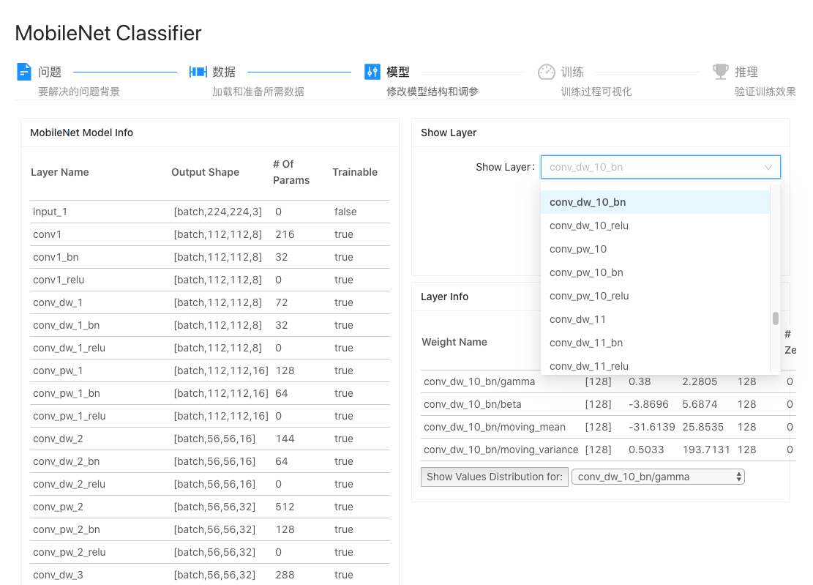

# 使用预训练模型——MobileNet 图片分类器

Google 提供了预训练的 MobileNet 图片分类器，我们可以直接使用它。

## MobileNet 使用的数据集 —— ImageNet

### ImageNet 的 1000 个分类

MobileNet 的训练数据集为 ImageNet，包括 1000 个分类。让我们看看这 1000 个分类是什么，参考代码为 `./src/components/mobilenet/ImageNetClasses.ts`：

	export interface ILabelMap {
	    [index: number]: string
	}

	export const ImageNetClasses: ILabelMap = {
	    0: 'tench, Tinca tinca',
	    1: 'goldfish, Carassius auratus',
	    2: 'great white shark, white shark, man-eater, man-eating shark, ' +
	      'Carcharodon carcharias',
	    3: 'tiger shark, Galeocerdo cuvieri',
	    4: 'hammerhead, hammerhead shark',
	    5: 'electric ray, crampfish, numbfish, torpedo',
	    6: 'stingray',
	    7: 'cock',
	    ...
    }

### 使用 AntD Tags 展示分类

参考代码为 `./src/components/mobilenet/ImageNetTagsWidget.tsx`：

	const ImageNetTagsWidget = (): JSX.Element => {
		...
		return (
			...
                {Object.keys(ImageNetClasses).map((key, index) => {
                    const tag = ImageNetClasses[index]
                    const isLongTag = tag.length > 20
                    const tagElem = (
                        <Tag key={tag}>
                            {isLongTag ? `${tag.slice(0, 20)}...` : tag}
                        </Tag>
                    )
                    return isLongTag ? (
                        <Tooltip title={tag} key={tag}>
                            {tagElem}
                        </Tooltip>
                    ) : (
                        tagElem
                    )
                })}
            ...
		)
	}

## MobileNet 图片分类器模型

参考代码为 `./src/components/mobilenet/MobileNetClassifier.tsx`

### 预训练模型下载

在使用 MobileNet 模型前，需要对预训练模型进行下载。

* 我们可以使用 URL 直接从 Google 下载。

		export const MOBILENET_MODEL_PATH = 'https://storage.googleapis.com/tfjs-models/tfjs/mobilenet_v1_0.25_224/model.json'

* 也可以提前下载，然后本地加载。

	执行下面的语句下载预训练的模型。下载完成后，可以进入对应的目录，观察一下用于 Tfjs 的模型到底是什么模样。
	
		$ cd ./public/preload/model/
		$ python3 ./tfjs_mobilenet_model_downloader.py

	使用本地 URL 加载：
	
		export const MOBILENET_MODEL_PATH = '/preload/model/mobilenet/mobilenet_v1_0.25_224/model.json'
		
### 用 tf.loadLayersModel 模型加载 

	useEffect(() => {
        logger('init model ...')

        tf.backend()
        setTfBackend(tf.getBackend())

        setStatus(STATUS.WAITING)

        let model: tf.LayersModel
        tf.loadLayersModel(MOBILENET_MODEL_PATH).then(
            (mobilenet) => {
                model = mobilenet

                // Warmup the model. This isn't necessary, but makes the first prediction
                // faster. Call `dispose` to release the WebGL memory allocated for the return
                // value of `predict`.
                const temp = model.predict(tf.zeros([1, MOBILENET_IMAGE_SIZE, MOBILENET_IMAGE_SIZE, 3])) as tf.Tensor
                temp.dispose()

                setModel(model)

                const layerOptions: ILayerSelectOption[] = model?.layers.map((l, index) => {
                    return { name: l.name, index }
                })
                setLayersOption(layerOptions)

                setStatus(STATUS.LOADED)
            },
            loggerError
        )

        return () => {
            logger('Model Dispose')
            model?.dispose()
        }
    }, [])

* 使用 `tf.loadLayersModel(MOBILENET_MODEL_PATH)` 加载预训练的 MobileNet 模型及权重。
* 加载后，可以做下模型预热，并非必须，不过可以提升第一次 predict 的速度。

                // Warmup the model. This isn't necessary, but makes the first prediction
                // faster. Call `dispose` to release the WebGL memory allocated for the return
                // value of `predict`.
                const temp = model.predict(tf.zeros([1, MOBILENET_IMAGE_SIZE, MOBILENET_IMAGE_SIZE, 3])) as tf.Tensor
                temp.dispose()
                
* 提取模型的 Layers 信息，用于详细观察 Layers 的具体情况。

                const layerOptions: ILayerSelectOption[] = model?.layers.map((l, index) => {
                    return { name: l.name, index }
                })
                setLayersOption(layerOptions)

### 模型的展示

			<TabPane tab='&nbsp;' key={AIProcessTabPanes.MODEL}>
                <Row>
                    <Col span={12}>
                        <Card title='MobileNet Model Info' style={{ margin: '8px' }} size='small'>
                            <TfvisModelWidget model={sModel}/>
                        </Card>
                    </Col>
                    <Col span={12}>
                        <Card title='Show Layer' style={{ margin: '8px' }} size='small'>
                            <Form {...layout} initialValues={{
                                layer: 0
                            }}>
                                <Form.Item name='layer' label='Show Layer'>
                                    <Select onChange={handleLayerChange}>
                                        {sLayersOption?.map((v) => {
                                            return <Option key={v.index} value={v.index}>{v.name}</Option>
                                        })}
                                    </Select>
                                </Form.Item>
                                <Form.Item {...tailLayout}>
                                    
status: {sStatus}

                                    
backend: {sTfBackend}

                                </Form.Item>
                            </Form>
                        </Card>
                        <Card title='Layer Info' style={{ margin: '8px' }} size='small'>
                            <TfvisLayerWidget layer={sCurLayer}/>
                        </Card>
                    </Col>
                </Row>
            </TabPane>

* `TfvisModelWidget` 是集成了 tfjs-vis 的 React 组件，能够方便的展示模型的更多信息。
* `TfvisLayerWidget` 是集成了 tfjs-vis 的 React 组件，能够方便的展示各个 Layer 的更多信息。**已知问题** 对于无参数的 Layer 选择 'Show Values Distribution for' 可能会抛出异常。

## 推理

### 图片上传显示组件

#### ImageUploadWidget

	import React, { useEffect, useRef, useState } from 'react'
	import * as tf from '@tensorflow/tfjs'
	import { Button, Row } from 'antd'
	
	import PicturesWall from '../../common/PicturesWall'
	import { ImageNetClasses } from '../../mobilenet/ImageNetClasses'
	import { IKnnPredictResult, ILabelMap, logger } from '../../../utils'
	
	interface IProps {
	    prediction?: tf.Tensor | IKnnPredictResult
	    labelsMap?: ILabelMap
	    onSubmit?: (tensor: tf.Tensor) => void
	}
	
	const IMAGE_HEIGHT = 360
	
	const ImageUploadWidget = (props: IProps): JSX.Element => {
	    const [sImgViewSrc, setImgViewSrc] = useState<string>('/images/cat.jpg')
	    const [sLabel, setLabel] = useState<string>()
	
	    const imageViewRef = useRef<HTMLImageElement>(null)
	
	    useEffect(() => {
	        if (!props.prediction) {
	            return
	        }
	
	        const knnRet = props.prediction as IKnnPredictResult
	        if (knnRet.label) {
	            const knnRet = props.prediction as IKnnPredictResult
	            setLabel(`${knnRet.label} : ${JSON.stringify(knnRet.confidences)}`)
	        } else {
	            // ImageNet Classes
	            const imagenetPred = props.prediction as tf.Tensor
	            const labelIndex = imagenetPred.arraySync() as number
	            logger('labelIndex', labelIndex)
	            const _label = props.labelsMap ? props.labelsMap[labelIndex] : ImageNetClasses[labelIndex]
	            setLabel(`${labelIndex.toString()} : ${_label}`)
	        }
	    }, [props.prediction])
	
	    const handlePreview = (file: string): void => {
	        // logger('handlePreview', file)
	        setImgViewSrc(file)
	    }
	
	    const handleSubmit = (): void => {
	        if (!imageViewRef.current) {
	            return
	        }
	        const _tensor = tf.browser.fromPixels(imageViewRef.current).toFloat()
	        props.onSubmit && props.onSubmit(_tensor)
	    }
	
	    /***********************
	     * Render
	     ***********************/
	
	    return (
	        <>
	            <Row className='centerContainer'>
	                
	            </Row>
	            <Row className='centerContainer'>
	                <Button onClick={handleSubmit} type='primary' style={{ width: '30%', margin: '8px' }}>Predict</Button>
	            </Row>
	            <Row className='centerContainer' >
	                {sLabel && (
	                    {sLabel}
	                )}
	            </Row>
	            <PicturesWall onPreview={handlePreview} />
	        </>
	    )
	}
	
	export default ImageUploadWidget

#### PicturesWall

	import React, { useEffect, useReducer, useState } from 'react'
	import { Modal, Upload } from 'antd'
	import { PlusOutlined } from '@ant-design/icons'
	import { RcFile, UploadChangeParam, UploadFile } from 'antd/es/upload/interface'
	import { checkUploadDone, getUploadFileBase64, logger } from '../../utils'
	
	interface IProps {
	    onPreview?: (file: string) => void
	}
	
	const PicturesWall = (props: IProps): JSX.Element => {
	    const [previewImage, setPreviewImage] = useState<string>()
	    const [imageList, setImageList] = useState<UploadFile[]>([])
	    const [modelDisplay, setModalDisplay] = useState(false)
	
	    const [waitingPush, forceWaitingPush] = useReducer((x: number) => x + 1, 0)
	
	    useEffect(() => {
	        // eslint-disable-next-line @typescript-eslint/no-misused-promises
	        const timer = setInterval(async (): Promise<void> => {
	            logger('Waiting upload...')
	            if (checkUploadDone(imageList) > 0) {
	                forceWaitingPush()
	            } else {
	                clearInterval(timer)
	
	                const _file = imageList[imageList.length - 1]
	                if (_file) {
	                    await handlePreview(_file)
	                }
	            }
	        }, 10)
	
	        return () => {
	            clearInterval(timer)
	        }
	    }, [waitingPush])
	
	    const handleCancel = (): void => {
	        setModalDisplay(false)
	    }
	
	    const handlePreview = async (file: UploadFile): Promise<void> => {
	        // logger('handlePreview', file)
	
	        let imgSrc = file.url ?? file.preview
	        if (!imgSrc) {
	            const result = await getUploadFileBase64(file.originFileObj)
	            file.preview = result
	            imgSrc = file.preview
	        }
	
	        if (imgSrc) {
	            setPreviewImage(imgSrc)
	            // setModalDispaly(true)
	            props.onPreview && props.onPreview(imgSrc)
	        }
	    }
	
	    const handleChange = ({ fileList }: UploadChangeParam): void => {
	        // logger('handleChange', fileList)
	        setImageList(fileList)
	
	        // Must wait until all file status is 'done', then push then to LabeledImageWidget
	        forceWaitingPush()
	    }
	
	    const handleUpload = async (file: RcFile): Promise<string> => {
	        // logger(file)
	        return getUploadFileBase64(file)
	    }
	
	    const uploadButton = (
	        

	            <PlusOutlined />
	            
Upload

	        

	    )
	
	    return (
	        

	            <Upload action={handleUpload} fileList={imageList} onPreview={handlePreview} onChange={handleChange}
	                listType='picture-card'>
	                {imageList.length >= 8 ? null : uploadButton}
	            </Upload>
	
	            <Modal visible={modelDisplay} footer={null} onCancel={handleCancel}>
	                
	            </Modal>
	        

	    )
	}
	
	export default PicturesWall

### 摄像头拍照组件 —— WebCamera

	import React, { forwardRef, Ref, useEffect, useImperativeHandle, useRef, useState } from 'react'
	import * as tf from '@tensorflow/tfjs'
	import { WebcamIterator } from '@tensorflow/tfjs-data/dist/iterators/webcam_iterator'
	import { Button, Row, Col } from 'antd'
	import { CameraOutlined } from '@ant-design/icons'
	
	import { IKnnPredictResult, ILabelMap, logger, loggerError } from '../../../utils'
	import { ImageNetClasses } from '../../mobilenet/ImageNetClasses'
	
	import TensorImageThumbWidget from './TensorImageThumbWidget'
	
	const VIDEO_SHAPE = [480, 360] // [width, height]
	const IMAGE_HEIGHT = 86
	
	const DEFAULT_CONFIG = {
	    // facingMode: 'user',
	    // resizeWidth: VIDEO_SHAPE[0],
	    // resizeHeight: VIDEO_SHAPE[1],
	    centerCrop: false
	}
	
	export interface IWebCameraHandler {
	    capture: () => Promise<tf.Tensor3D | void>
	}
	
	interface IProps {
	    prediction?: tf.Tensor | IKnnPredictResult
	    isPreview?: boolean
	    labelsMap?: ILabelMap
	    config?: tf.data.WebcamConfig
	
	    onSubmit?: (tensor: tf.Tensor) => void
	}
	
	const WebCamera = (props: IProps, ref: Ref<IWebCameraHandler>): JSX.Element => {
	    const [sLabel, setLabel] = useState<string>()
	    const [sPreview, setPreview] = useState<tf.Tensor3D>()
	
	    const [sCamera, setCamera] = useState<WebcamIterator>()
	    const videoRef = useRef<HTMLVideoElement>(null)
	
	    useImperativeHandle(ref, (): IWebCameraHandler => ({
	        capture
	    }))
	
	    useEffect(() => {
	        if (!videoRef.current) {
	            return
	        }
	
	        let _cam: WebcamIterator
	
	        const config = props.config ? props.config : DEFAULT_CONFIG
	        tf.data.webcam(videoRef.current, config).then(
	            (cam) => {
	                _cam = cam
	                setCamera(cam)
	            },
	            loggerError
	        )
	
	        return () => {
	            _cam?.stop()
	        }
	    }, [videoRef, props.config])
	
	    useEffect(() => {
	        if (!props.prediction) {
	            return
	        }
	
	        const knnRet = props.prediction as IKnnPredictResult
	        if (knnRet.label) {
	            const knnRet = props.prediction as IKnnPredictResult
	            setLabel(`${knnRet.label} : ${JSON.stringify(knnRet.confidences)}`)
	        } else {
	            // ImageNet Classes
	            const imagenetRet = props.prediction as tf.Tensor
	            const labelIndex = imagenetRet.arraySync() as number
	            logger('labelIndex', labelIndex)
	            const _label = props.labelsMap ? props.labelsMap[labelIndex] : ImageNetClasses[labelIndex]
	            setLabel(`${labelIndex.toString()} : ${_label}`)
	        }
	    }, [props.prediction])
	
	    const capture = async (): Promise<tf.Tensor3D | void> => {
	        if (!sCamera) {
	            return
	        }
	        return sCamera.capture()
	    }
	
	    const handleCapture = async (): Promise<void> => {
	        const imgTensor = await capture()
	        props.isPreview && setPreview(imgTensor as tf.Tensor3D)
	    }
	
	    const handleSubmit = async (): Promise<void> => {
	        const imgTensor = await capture()
	        if (imgTensor) {
	            props.isPreview && setPreview(imgTensor)
	            props.onSubmit && props.onSubmit(imgTensor)
	        }
	    }
	
	    /***********************
	     * Render
	     ***********************/
	
	    return (
	        <>
	            <Row className='centerContainer'>
	                <video autoPlay muted playsInline width={VIDEO_SHAPE[0]} height={VIDEO_SHAPE[1]} ref={videoRef}
	                    style={{ backgroundColor: 'lightgray' }}/>
	            </Row>
	            <Row className='centerContainer'>
	                

	                    {props.isPreview && (
	                        <Button style={{ width: '30%', margin: '0 10%' }} icon={<CameraOutlined />}
	                            onClick={handleCapture} >Capture</Button>
	                    )}
	                    {props.onSubmit && (
	                        <Button onClick={handleSubmit} type='primary' style={{ width: '30%', margin: '0 10%' }}>Predict</Button>
	                    )}
	                

	            </Row>
	            <Row >
	                {props.isPreview && (
	                    <Col span={12}>
	                        
Captured Images

	                        

	                            {sPreview && <TensorImageThumbWidget height={IMAGE_HEIGHT} data={sPreview}/>}
	                        

	                    </Col>
	                )}
	                {sLabel && (
	                    <Col span={12}>
	                        
 Prediction Result 

	                        
{sLabel}

	                    </Col>
	                )}
	            </Row>
	        </>
	    )
	}
	
	export default forwardRef(WebCamera)
