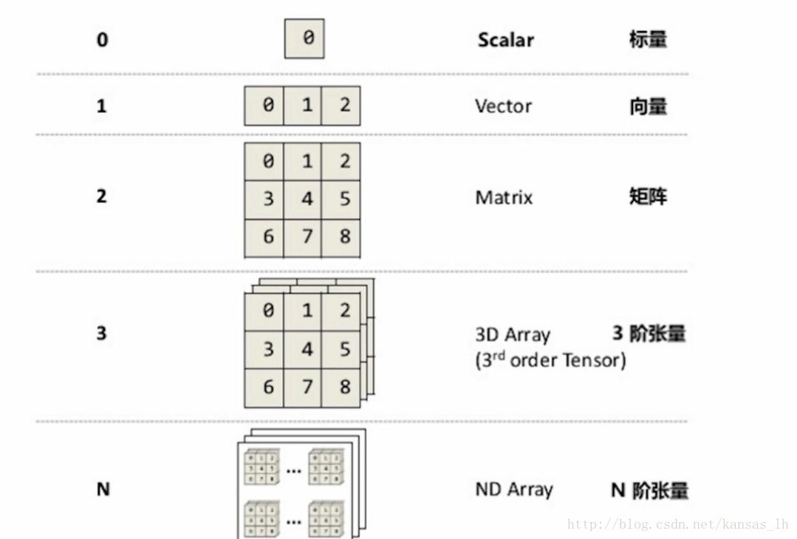
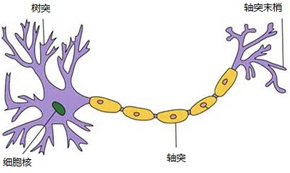

# 初步了解 Tensorflow.js 

让我们从曲线拟合这个例子开始 Tensorflow.js 之旅。

## Tensor 及其运算

我们让 AI 也来做类似的试题：

$$ Y = f(X) $$

给出一组 X 和 Y 的对应“训练数据”，让 AI 学习其中的规律，然后随机给出一个数字 x ，让 AI 计算应该得什么 y。

## 数据

我们先用程序生成一组 X, Y 的 对应关系。

$$ y = a x^2 + b x + c $$

a, b, c 三个参数随机生成。tfjs 里面有好几种用于生成随机数的方法，用起来非常简便。下面的代码生成了 0 到 10 之间的三个随机数，我们取整之后，用作 a, b, c。 

	import * as tf from '@tensorflow/tfjs-node'
	let params = tf.randomUniform([3], 0, 10).toInt()
	params.print()
	let [a, b, c] = Array.from(params.dataSync())
	console.log(a, b, c)

上面题目中的数据，就使用以下的代码计算生成 a, b, c 分别取值 7, 3, 5。需要注意的是，这种链式的调用仅仅与顺序有关，没有先乘除后加减的计算符的优先级。

	import * as tf from '@tensorflow/tfjs'
	let x = tf.range(1, 12)
	let y = x.pow(2).mul(a).add( x.mul(b) ).add(c)
	x.print()
	y.print()
	
切换到命令行下，在项目目录中，试试执行这些代码吧：

	$ cd node
	$ yarn
		
	$ yarn run ts-node
	> import * as tf from '@tensorflow/tfjs-node'	{}
	> let params = tf.randomUniform([3], -10, 10).toInt()
	> params.print()
	Tensor
		[8, 5, 4]
	> let [a, b, c] = Array.from(params.dataSync())
	> console.log(a, b, c)
	8 5 4
	>
	> let x = tf.range(1, 12)
	> let y = x.pow(2).mul(a).add( x.mul(b) ).add(c)
	undefined
	> x.print()
	Tensor
		[1, 2, 3, 4, 5, 6, 7, 8, 9, 10, 11]
	> y.print()
		[17, 46, 91, 152, 229, 322, 431, 556, 697, 854, 1027]
	>

### Tensor

Tensor就是一个数据单元的通用术语，也是 Tensorflow 的基础概念——张量。简单说来，就是多维数据量。

下图介绍了张量的维度（秩）：Rank/Order

 

#### Tensor的典型属性

1. 数据类型dtype：d是data的首字母，type是类型的意思。tensor里每一个元素的数据类型是一样的。类似于Numpy中ndarray.dtype，tensorflow里的数据类型可以有很多种，比方说tf.float32就是32位的浮点数，tf.int8就是8位的整型，tf.unit8就是8位的无符号整型，tf.string为字符串等等。
2. 形状Shape：比方说一个2行3列的二维矩阵，他的形状就是2行3列。Tensor的形状可以通过 Reshape 等函数进行变换。Shape的描述顺序是由外到内（最左边的Shape是最外层的维度，reshape时，最外层可以设置为 -1，表示按照实际计算返回）。

### 为模型训练准备数据

有了公式，我们能够为模型训练提供足够的数据。这些数据通常被分为三个集合：

* 训练集：确定模型后，用于训练参数，注意训练的是普通参数（每多加入一个数据对模型进行训练，模型中就会受到影响的参数，通过多次迭代不断更新，是一个梯度下降的过程）而不是超参数（超参数是指训练开始之前设置的参数，超参数的选择与训练过程实际上是独立的，训练过程不会影响超参数。但是训练结束后可以根据训练结果考虑超参数是否可优化，可优化的话就调整超参数的值开始下一次训练）
* 验证集：用训练集对模型训练完毕后，再用验证集对模型测试，测试模型是否准确而不是训练模型的参数
* 测试集：虽然验证集没有对模型的参数产生影响，但是我们却根据验证集的测试结果的准确度来调整参数（这里调整超参数），所以验证集对结果还是有影响的，即使得模型在验证集上达到最优。在很多个模型中，验证集选择了代价函数最小的一个模型。虽然在这个模型上代价很小，但并不代表在其他数据上代价也小。所以需要一个完全没有经过训练的测试集来再最后测试模型的准确率。

### 代码中的实现

用下面的代码，为模型训练准备了训练集和测试集。在大多数场景下，我们会从训练集中抽出一部分数据作为验证集。

**注意** 我们生成的 X 是 (-1, 1) 的浮点数，而不是像前面的例子那样，直接生成整数变量。这是在机器学习中非常重要的一种手段——归一化。对变量按照每个维度做归一化，将他们变换到 (-1, 1) 或者 (0, 1) 之间，能够使不同维度的数据“公平竞争”，并减少数据溢出的风险。

	const calc = useCallback((x: tf.Tensor) => {
		const [a, b, c] = sCurveParams			// = a * x^2 + b * x + c
		return x.pow(2).mul(a).add(x.mul(b)).add(c)
	}, [sCurveParams])
    
	logger('init data set ...')
	// train set
	const _trainTensorX = tf.randomUniform([totalRecord], -1, 1)
	const _trainTensorY = calc(_trainTensorX)
	setTrainSet({ xs: _trainTensorX, ys: _trainTensorY })
		
	// test set
	const _testTensorX = tf.randomUniform([testRecord], -1, 1)
	const _testTensorY = calc(_testTensorX)
	setTestSet({ xs: _testTensorX, ys: _testTensorY })

## 模型

### 人工神经元模型

人工神经网络是一种从信息处理角度模仿人脑神经元的数学模型，最初是由生物学家大约在1943年提出来的（爷爷辈儿的理论），是一种仿生类的模型，生物学中的神经元模型通常是由树突、轴突、细胞核等组成，其基本结构如图所示。

 

在人工神经网络中，拥有数量非常多的神经元，它们之间相连组成神经网络，并且神经元之间都有连接权值，称为权重，是模仿人脑中“记忆”机制，神经网络中的每一个节点都代表着一种特定的输出，称为“激励函数”，其大致结构如图所示：

 

神经网络从两个方面模拟大脑：

1. 神经网络获取的知识是从外界环境中学习得来的。
2. 内部神经元的连接强度，即突触权值，用于储存获取的知识。

神经网络系统由能够处理人类大脑不同部分之间信息传递的由大量神经元连接形成的拓扑结构组成，依赖于这些庞大的神经元数目和它们之间的联系，人类的大脑能够收到输入的信息的刺激由分布式并行处理的神经元相互连接进行非线性映射处理，从而实现复杂的信息处理和推理任务。
对于某个处理单元（神经元）来说，假设来自其他处理单元（神经元）i的信息为Xi，它们与本处理单元的互相作用强度即连接权值为Wi, i=0,1,…,n-1,处理单元的内部阈值为θ。那么本处理单元（神经元）的输入为：

$$ \sum_{i=0}^{n-1} w_i x_i $$

而处理单元的输出为：

$$ y = f( \sum_{i=0}^{n-1} ( w_i x_i - \theta )) $$

f称为激活函数或作用函数，它决定节点（神经元）的输出。θ表示隐含层神经节点的阈值。最经典的激活函数是 Sigmoid 函数。

### 多层人工神经网络

不太严格来说，当前人工智能最红的深度神经网络，可以被理解为就是“更多层”的人工神经网络。

人工神经网络包括：输入层、输出层、以及两者之间的隐藏层。每一层网络包括 n 个神经元，这些神经元，也可以有不同的激活函数。

在随机梯度下降算法和反向传播算法完善之后，神经网络曾经有个快速发展的时期。

简单的浅层的网络已经能够完成一部分工作，手写数字识别准确率可以达到了98%以上。但对于更复杂的挑战，浅层网络就表现不佳了。

如何改进？直觉上来说，我们会觉得增加包含更多层隐藏层的深度网络会更好。

但是，在尝试使用主力学习算法——随机梯度下降算法时，深度网络没有表现的比浅层网络更好。这个失败的结果确实很意外。经过仔细观察后发现，深度网络中的不同层学习的速度差别很大。具体来说就是，当网络后面的层学习很好的时候，前面的层的学习经常会卡住，几乎学不到任何东西。相反的现象也会发生：前面层的学习很好，后面的层学习会卡住。这个问题与运气无关，跟基于梯度的学习算法有关。在深度网络中，基于梯度下降的学习算法有一种内在的不稳定性。这种不稳定性导致前面或则后面层的学习卡住。

要训练深度网络，就必须解决梯度不稳定的问题。这个问题卡了10多年。2010年Glorot和Bengio发现sigmoid激活函数会导致最后一层隐藏层的输出在0附近饱和，导致学习变慢的问题。他们建议使用一些替换的激活函数。2013年Sutskever, Martens, Dahl 和 Hinton研究了随机权重初始化和动量梯度下降对深度学习的影响。研究的结果是：训练的梯度不稳定跟所用的激活函数、权重初始化的方式、甚至梯度下降的具体实现形式都有关系。当然网络的结构，其他超参的取值也很重要，原因是多方面的，不过随后的发展，开发出的各种方法某种程度上克服了或则是绕过了这些障碍，最终促进了深度神经网络的成功。

Google 提供了一个非常直观的理解多层神经网络的工具 NN PlayGround 。

[NN PlayGround](http://playground.tensorflow.org/)

### 激活函数

常见的激活函数有：Sigmoid、ReLU、Tanh 等。

#### Sigmoid S型生长曲线

$$ sigmoid(x) = \frac{1}{1+e^{-x}} $$

Sigmoid函数曾被广泛地应用，也是非常经典的logic函数。

优点：

* Sigmoid函数的输出映射在(0,1)之间，单调连续，输出范围有限，优化稳定，可以用作输出层
* 求导容易

缺点：

* 由于其软饱和性，容易产生梯度消失，导致训练出现问题
* 其输出并不是以0为中心的。

#### ReLU 

$$ relu(x) = max(0, x) $$

优点是：

* 可以更加简单的实现
* 相比起Sigmoid和tanh能够在 SGD 中快速收敛
* 有效缓解了梯度消失的问题
* 在没有无监督预训练的时候也能有较好的表现
* 提供了神经网络的稀疏表达能力

缺点是：

* 随着训练的进行，可能会出现神经元死亡，权重无法更新的情况。如果发生这种情况，那么流经神经元的梯度从这一点开始将永远是0。也就是说，ReLU神经元在训练中不可逆地死亡了。如果使用 ReLU，要小心设置 learning rate，注意不要让网络出现很多 “dead” 神经元，如果不好解决，可以试试 Leaky ReLU、PReLU 或者 Maxout.

ReLU 有不少变形算法。

#### Tanh 双曲正切

$$ tanh(x) = \frac{1 - e^{-2x}}{1 + e^{-2x}} $$

优点：

* 比Sigmoid函数收敛速度更快。
* 相比Sigmoid函数，其输出以0为中心。

缺点：

* 还是没有改变Sigmoid函数的最大问题——由于饱和性产生的梯度消失。

### 代码中的实现

在代码中，你可以选择体验的隐藏层数量、隐藏层内神经元数量、以及激活函数的不同，给训练带来的影响。

激活函数的设定和 Layer 在一起，例如：

	const model = tf.sequential()
	model.add(tf.layers.dense({ inputShape: [1], units: sDenseUnits, activation: sActivation as any }))
	for (let i = sLayerCount - 2; i > 0; i--) {
		model.add(tf.layers.dense({ units: sDenseUnits, activation: sActivation as any }))
	}
	model.add(tf.layers.dense({ units: 1 }))

## 训练

在神经元网络模型确定之后，还需要设置优化器，才能进行训练。以 SGD 算法为例，通过调整 Learning Rate 参数，会改变学习的收敛速度，以及学习精度。

	const optimizer = tf.train.sgd(sLearningRate)
	model.compile({ loss: 'meanSquaredError', optimizer })

训练时，还需要指定下面的参数：

* epochs 迭代次数
* batchSize 因为计算环境资源有限，每次取用合适的数据量，以避免内存溢出等问题。
* validationSplit 从训练集中挑选验证集数据的比率

		model.fit(trainSet.xs as tf.Tensor, trainSet.ys as tf.Tensor, {
			epochs: NUM_EPOCHS,
			batchSize: BATCH_SIZE,
			validationSplit: VALIDATE_SPLIT,
			callbacks: {
				onEpochEnd: (epoch: number) => {
					...
					if (stopRef.current) {
						logger('Checked stop', stopRef.current)
						statusRef.current = STATUS.STOPPED
						model.stopTraining = stopRef.current
					}
				}
			}
		}).then(
			() => {
				statusRef.current = STATUS.TRAINED
			}
		)

## 推理

模型训练好之后，可以通过 model.predict 或 model.evaluate 来检验训练结果。

	const pred = model.predict(testSet.xs as tf.Tensor) as tf.Tensor
	setTestP(pred)
	const evaluate = model.evaluate(testSet.xs as tf.Tensor, testSet.ys as tf.Tensor) as tf.Scalar
	setTestV(evaluate)

## 补充内容

[参考链接 Tensorflow.js API 文档](https://js.tensorflow.org/api/latest/?hl=zh-cn)

#### Tensor 的常用运算

| API | 说明 |
|---|---|
| tf.add | a + b |
| tf.sub | a - b |
| tf.mul | a * b |
| tf.div | a / b |
| tf.addN | a + [b, c, d...] |
| tf.divNoNan | 相除分母为0时，返回0 |
| tf.floorDiv | 相除结果取下整 |
| tf.maximum | a, b直接对应元素取大值 |
| tf.minimum | a, b直接对应元素取小值 |
| tf.mod | 对应元素取模 |
| tf.pow | 对应元素取幂 |
| tf.squaredDifference | (a - b) * (a - b) |
| tf.dot | 点乘 |

tf 还有各种数学函数可以使用。

#### Tensorflow.js 的随机数生成 API

| API | 说明 |
|---|---|
| tf.randomUniform | 均匀分布采样 |
| tf.randomNormal | 正态分布采样 |
| tf.multinomial | 多项式分布采样 |
| tf.randomGamma | Gamma分布采样 |

#### Tensor 的常用变形

| API | 说明 |
|---|---|
| tf.reshape | 根据给出的 Shape 变形 |
| tf.reshapeAs | 根据给出的 Tensor 变形 |
| tf.expandDims | 增加一个维度 |
| tf.flatten | 把Tensor转换成 1 维数组 |

#### 更多激活函数

[参考链接 wikipedia](https://en.wikipedia.org/wiki/Activation_function)

## 拓展阅读

关于 Tensor

* [CSDN 穿秋裤的兔子的文章](https://blog.csdn.net/kansas_lh/article/details/79321234)
* [机器学习的敲门砖：手把手教你TensorFlow初级入门](https://yq.aliyun.com/articles/64410?utm_content=m_32686)

人工神经元模型

* [参考链接，简书](https://www.jianshu.com/p/f73f5985cda4)
* [参考链接，简书](https://www.jianshu.com/p/3d8802fe7853)

多层人工神经网络

* [神经网络与深度学习（五）：深度网络训练难点](https://blog.csdn.net/gaofeipaopaotang/article/details/80002590)

激活函数

* [参考链接](https://www.jiqizhixin.com/graph/technologies/1697e627-30e7-48a6-b799-39e2338ffab5)
* [参考链接: 不会停的蜗牛](https://www.jianshu.com/p/22d9720dbf1a)

《神经网络和深度学习简史》

* [神经网络和深度学习简史（第一部分）：从感知机到BP算法](https://www.jianshu.com/p/f90d923b73b5)
* [神经网络和深度学习简史（第二部分）：BP算法之后的又一突破——信念网络](https://www.jianshu.com/p/9dc4c2320732)
* [神经网络和深度学习简史（第三部分）：90年代的兴衰——强化学习与递归神经网络](https://www.jianshu.com/p/5db8170d4bcb)
* [神经网络和深度学习简史（第四部分）：深度学习终迎伟大复兴](https://www.jianshu.com/p/e1bac195f06d)

《神经网络和深度学习简史》

* [神经网络和深度学习简史（一）](https://www.jianshu.com/p/c9a2a0c446d4)
* [深度学习和神经网络简史（二）](https://www.jianshu.com/p/558a2c0a5b9b)
* [神经网络和深度学习简史（三）](https://www.jianshu.com/p/70209952de90)
* [神经网络和深度学习简史（四）](https://www.jianshu.com/p/757c5a57c5d2)
