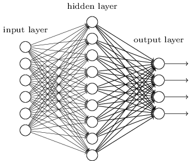

# 初步了解 Tensorflow.js

TensorFlow.js 是 Goolge Tensorflow 的 JS 版本，将高性能机器学习能力带到 JS 世界。

通过《曲线拟合》这个例子，我们对 Tensorflow.js 进行初步了解。在这个例子中，我们要构建一个一元二次方程，并观察使用人工神经网络模型求解的过程。

## 使用 Tensorflow.js 的几点须知

官方文档 [平台和环境](https://www.tensorflow.org/js/guide/platform_environment)
中，描述了使用 tfjs 的须知，下面的内容列举了其中必须了解的几点。在此，我们先做介绍，稍后在代码中体现。
 
### Backend —— 为什么我的 tfjs 运行很慢？

慢这件事，确实不好讲，不过了解 Tensorflow.js 运行 backend 的一些背景，会有些帮助。

TensorFlow.js 开发的程序运行时，所有的配置被统称为环境。它包含一个全局的backend，以及一些可以精确控制 TensorFlow.js 特性的标记。

TensorFlow.js 有两种工作平台：浏览器和 Node.js。不同平台有很多不同的配置，平台间的差异影响着基于平台的应用开发。

* 在浏览器平台上，TensorFlow.js 既支持移动设备，也支持台式设备，使用 WebGL API 作为 backend，自动检测并做相应的优化配置。你可以检查一下，浏览器中是否已开启“硬件加速模式”。

* 在 Node.js 平台上，TensorFlow.js 支持直接使用 TensorFlow 的 C 语言 API 来加速操作，它会尽可能使用机器的 GPU 硬件加速模块，如 CUDA。也支持更慢的 CPU 环境。

### 内存管理 —— 这样避免我的程序内存溢出？

使用 WebGL backend 时，**需要显式管理内存**。因为存储Tensor的WebGL纹理，不会被浏览器的垃圾收集机制自动清理。

* 调用dispose()清理tf.Tensor占用的内存
* 在应用中，经常需要把多个操作组合起来。TensorFlow.js提供tf.tidy()方法，可以将  多个操作组合封装在函数中。函数返回时，会清理不再需要的tf.Tensor，这就好像函数执行后，本地变量都会被清理一样。

在一些非 WebGL 环境，有自动垃圾回收机制，在这些环境下使用dispose()或tidy()没有副作用。不过，主动调用通常会比垃圾回收的清理带来更好的性能。

### tfjs 安装

Web 端安装

	$ yarn add @tensorflow/tfjs
	
Node.js 使用 TensorFlow.js 原生 C++ 加速。**坑**：MAC OS上，安装时会对原生 C++ 依赖包进行下载编译，慢，执行 gyp 需要使用 python v2 环境。

	$ yarn add @tensorflow/tfjs-node
	
Node.js 使用 TensorFlow.js GPU 加速（ Linux Only）

	$ yarn add @tensorflow/tfjs-node-gpu 

### tfjs 加载

基于浏览器的版本，加载 @tensorflow/tfjs 使用 tensorflow.js。如果是在 Node.js 环境中使用，需要引入 `@tensorflow/tfjs-node` 或 `@tensorflow/tfjs-gpu`

	import * as tf from '@tensorflow/tfjs'

## 使用 Tensorflow.js 和 React 生成数据集

下面的代码引用自 `./src/components/curve/curve.tsx`

$$ y = a x^2 + b x + c $$

### 随机生成 a, b, c 三个参数

	const [sCurveParams, setCurveParams] = useState<number[] | string>(INIT_PARAMS)

	const genCurveParams = (): number[] => {
	    return tf.tidy(() => {
	        const params = tf.randomUniform([3], -10, 10).toInt()
	        return Array.from(params.dataSync())
	    })
	}
		
	const Curve = (): JSX.Element => {
		...
	    useEffect(() => {
	        const [a, b, c] = genCurveParams()
	        setCurveParams([a, b, c])
	    }, [])
    	...
    }
	    
* `genCurveParams` 是个单纯的本地功能函数，放在 Curve 之外；使用它的 `useEffect` 被放在 Curve 组件的前部位置，符合我们前面说的使用 Hooks 的规则。
* `genCurveParams` 通过 `tf.randomUniform` 生成了 -10 到 10 之间的三个随机数，我们取整之后，用作 a, b, c。tfjs 里面还有好几种用于生成随机数的方法，用起来非常容易，可以根据问题需要使用。
* 这段代码被封装在 tf.tidy 中，以及时回收不用的内存。
* useEffect 第二个参数设置为 `[]`，表示在组件加载时调用。

### 实现公式计算

    const calc = useCallback((x: tf.Tensor) => {
        return tf.tidy(() => {
            const [a, b, c] = sCurveParams
            // = a * x^2 + b * x + c
            return x.pow(2).mul(a).add(x.mul(b)).add(c)
        })
    }, [sCurveParams])

* tf.Tensor 提供了很多用于张量计算的函数，使用函数式编程的链式调用用起来也比较方便。需要注意的是，这种链式的调用仅仅与顺序有关，没有“先乘除，后加减”的计算符的优先级。
* 假如在此处使用普通的 JS 函数实现，每一次 Curve 组件渲染都会生成一个新的 calc 函数实例。
* `useCallback` 是我们所用到的第三类 React Hook。`useCallback` 会返回一个 memoized 的函数，用来对函数进行缓存，防止总是重复的生成新的函数。calc 函数被封装到了 `useCallback` 之后，只有当触发条件 [sCurveParams] 被修改时，才会触发回调函数 calc 发生改变，创建新实例。在下一节的内容里，我们利用这个功能。仅在当 calc 由于参数改变而发生改变时，才触发对于训练集和测试集的更新。

### 训练集和测试集的生成

    const [sTrainSet, setTrainSet] = useState<tf.TensorContainerObject>()
    const [sTestSet, setTestSet] = useState<tf.TensorContainerObject>()
    ...
    
    useEffect(() => {
        logger('init data set ...')

        // train set
        const trainTensorX = tf.randomUniform([TOTAL_RECORD], -1, 1)
        const trainTensorY = calc(trainTensorX)
        setTrainSet({ xs: trainTensorX, ys: trainTensorY })

        // test set
        const testTensorX = tf.randomUniform([TEST_RECORD], -1, 1)
        const testTensorY = calc(testTensorX)
        setTestSet({ xs: testTensorX, ys: testTensorY })

        return () => {
            logger('Train Data Dispose')
            // Specify how to clean up after this effect:
            trainTensorX?.dispose()
            trainTensorY?.dispose()
            testTensorX?.dispose()
            testTensorY?.dispose()
        }
    }, [calc])
    
* 随机生成了 1000 个 (-1,1) 之间的浮点数，作为训练集 trainTensorX。随机生成了 200 个 (-1,1) 之间的浮点数，作为测试集 testTensorX。
* 初始化数据的 `useEffect` 函数和以前的用法相比，有了返回值。在 effect 中返回一个函数是 effect 的清除机制。每个 effect 都可以返回一个清除函数，它们都属于 effect 的一部分。对于 tfjs 应用来说，正好可以在这里清除不用的 tf.Tensor 对象，React Hooks 和 Tensorflow.js 真是相得益彰。React 会在执行当前 effect 之前对上一个 effect 进行清除。

		return () => {
            logger('Train Data Dispose')
            // Specify how to clean up after this effect:
            trainTensorX?.dispose()
            trainTensorY?.dispose()
            testTensorX?.dispose()
            testTensorY?.dispose()
        }

### 运用 AntD From 实现参数调整

AntD v4 的 Form 做了较大的修改，我们一起来看看。

	import React, { useCallback, useEffect, useRef, useState } from 'react'
	...
	import { Button, Card, Col, Form, Slider, Row, Select, Tabs } from 'antd'
	
	const Curve = (): JSX.Element => {
		...
		const [formData] = Form.useForm()
		...
		
		const handleResetCurveParams = (): void => {
	        const [a, b, c] = genCurveParams()
	        formData.setFieldsValue({ a, b, c })
	        setCurveParams([a, b, c])
	    }
	
	    const handleCurveParamsChange = (): void => {
	        const values = formData.getFieldsValue()
	        // logger('handleParamsFormChange', values)
	        const { a, b, c } = values
	        setCurveParams([a, b, c])
	    }
    
	    const curveParam = (): JSX.Element => {
	        return <Slider min={-10} max={10} marks={{ '-10': -10, 0: 0, 10: 10 }} />
	    }
	
	    const dataAdjustCard = (): JSX.Element => {
	        return (
	            <Card title='Adjust Data' style={{ margin: '8px' }} size='small'>
	                <Form {...layout} form={formData} onFieldsChange={handleCurveParamsChange}
	                    initialValues={{
	                        a: sCurveParams[0],
	                        b: sCurveParams[1],
	                        c: sCurveParams[2]
	                    }}>
	                    <Form.Item name='a' label='Curve param a'>
	                        {curveParam()}
	                    </Form.Item>
	                    ...
	                    <Form.Item {...tailLayout} >
	                        <Button onClick={handleResetCurveParams} style={{ width: '60%', margin: '0 20%' }}> Random a,b,c </Button>
	                        ...
	                    </Form.Item>
	                </Form>
	            </Card>
	        )
	    }
	    ...

* 在 Curve 组件的前部，使用 `const [formData] = Form.useForm()` 定义 Form 的数据域引用。`useForm` 只能用于函数组件。
* 在 Form 表单定义部分，使用 `form={formData}` 与数据域引用相关联。使用 `initialValues` 属性定义标点数据初始值。

		<Form {...layout} form={formData} onFieldsChange={handleCurveParamsChange}
	                    initialValues={{
	                        a: sCurveParams[0],
	                        b: sCurveParams[1],
	                        c: sCurveParams[2]
	                    }}>
	                    
* Form 内的各数据项使用 Form.Item 装饰。	其 `name`属性为 Form 内变量名称。
                 
		<Form.Item name='a' label='Curve param a'>
                        {curveParam()}
                    </Form.Item>
 
* 在界面上调整 Slider 组件时，会触发由 `onFieldsChange={handleCurveParamsChange}` 定义的回调函数。利用 `const values = formData.getFieldsValue()` 读取 Form 中的数据值。
* 点击 Button 时，`onClick={handleResetCurveParams}` 定义的回调函数会采用 `formData.setFieldsValue({ a, b, c })` 设置 From 中的数据值。

		<Button onClick={handleResetCurveParams} style={{ width: '60%', margin: '0 20%' }}> Random a,b,c </Button>
		
* 在 Form 中用 `onFinish` 函数设置 Form 的 Submit。

## 函数数据可视化

要对训练集和测试集数据进行直观的观察，我们使用了阿里巴巴的前端领域通用图表组件库 Bizchart。Bizchart 的功能相当强大，在这个项目中只使用了九牛一毛。[BizCharts参考链接](https://bizcharts.net/)

`./src/components/curve/CurveVis.tsx` 封装了函数曲线可视化的组件。

	<CurveVis xDataset={sTrainSet.xs as tf.Tensor} yDataset={sTrainSet.ys as tf.Tensor} sampleCount={TOTAL_RECORD}/>

CurveVis 的实现要点如下：

	import React, { useEffect, useState } from 'react'
	...
	import { Axis, Chart, Geom, Legend, Tooltip } from 'bizcharts'
	
	import { arrayDispose, logger } from '../../utils'
	
	const MAX_SAMPLES_COUNT = 100
	...
	interface IChartData {
	    x: number
	    y: number
	    type: string
	}

	interface IProps {
	    xDataset: Tensor
	    yDataset: Tensor
	    pDataset?: Tensor
	    sampleCount?: number
	
	    debug?: boolean
	}
	
	const CurveVis = (props: IProps): JSX.Element => {
	    /***********************
	     * useState
	     ***********************/
	
	    const [xData, setXData] = useState<number[]>([])
	    const [yData, setYData] = useState<number[]>([])
	    const [pData, setPData] = useState<number[]>([])
	    const [data, setData] = useState()
	    const [sampleCount] = useState(props.sampleCount)
	
		...
	    useEffect(() => {
	        logger('init sample data [p] ...')
	
	        const _data: IChartData[] = []
	        pData?.forEach((v: number, i: number) => {
	            _data.push({ x: xData[i], y: yData[i], type: 'y' })
	            _data.push({ x: xData[i], y: v, type: 'p' })
	        })
	        setData(_data)
	
	        return () => {
	            logger('Dispose sample data [p] ...')
	            arrayDispose(_data)
	        }
	    }, [pData])
	
	    /***********************
	     * Functions
	     ***********************/
	
	    return (
	        <Card>
	            <Chart height={400} data={data} padding='auto' forceFit>
	                <Axis name='X'/>
	                <Axis name='Y'/>
	                <Legend/>
	                <Tooltip/>
	                <Geom type='line' position='x*y' size={2} color={'type'} shape={'smooth'}/>
	            </Chart>
	            Sample count : {props.sampleCount}
	            {props.debug ? JSON.stringify(data) : ''}
	        </Card>
	    )
	}
	
	export default CurveVis
	
* 需要将从属性设置的 X、Y、P Tensor 转化成格式如下的数组。使用 IChartData.type 区分不同的曲线。

		interface IChartData {
		    x: number
		    y: number
		    type: string
		} 
		
		...
	    const _data: IChartData[] = []
	    pData?.forEach((v: number, i: number) => {
	        _data.push({ x: xData[i], y: yData[i], type: 'y' })
	        _data.push({ x: xData[i], y: v, type: 'p' })
	    })
	    setData(_data)

* 使用如下方式绘制函数曲线。 

		return (
	        <Card>
	            <Chart height={400} data={data} padding='auto' forceFit>
	                <Axis name='X'/>
	                <Axis name='Y'/>
	                <Legend/>
	                <Tooltip/>
	                <Geom type='line' position='x*y' size={2} color={'type'} shape={'smooth'}/>
	            </Chart>
	            Sample count : {props.sampleCount}
	            {props.debug ? JSON.stringify(data) : ''}
	        </Card>
	    )
                   
## 探究 Tensorflow.js 中的 LayerModel

## 训练 

=========

### Tensor

Tensor就是一个数据单元的通用术语，也是 Tensorflow 的基础概念——张量。简单说来，就是多维数据量。

下图介绍了张量的维度（秩）：Rank/Order

 

#### Tensor的典型属性

1. 数据类型dtype：d是data的首字母，type是类型的意思。tensor里每一个元素的数据类型是一样的。类似于Numpy中ndarray.dtype，tensorflow里的数据类型可以有很多种，比方说tf.float32就是32位的浮点数，tf.int8就是8位的整型，tf.unit8就是8位的无符号整型，tf.string为字符串等等。
2. 形状Shape：比方说一个2行3列的二维矩阵，他的形状就是2行3列。Tensor的形状可以通过 Reshape 等函数进行变换。Shape的描述顺序是由外到内（最左边的Shape是最外层的维度，reshape时，最外层可以设置为 -1，表示按照实际计算返回）。

## 模型

### 人工神经元模型

人工神经网络是一种从信息处理角度模仿人脑神经元的数学模型，最初是由生物学家大约在1943年提出来的（爷爷辈儿的理论），是一种仿生类的模型，生物学中的神经元模型通常是由树突、轴突、细胞核等组成，其基本结构如图所示。

 

在人工神经网络中，拥有数量非常多的神经元，它们之间相连组成神经网络，并且神经元之间都有连接权值，称为权重，是模仿人脑中“记忆”机制，神经网络中的每一个节点都代表着一种特定的输出，称为“激励函数”，其大致结构如图所示：

 

神经网络从两个方面模拟大脑：

1. 神经网络获取的知识是从外界环境中学习得来的。
2. 内部神经元的连接强度，即突触权值，用于储存获取的知识。

神经网络系统由能够处理人类大脑不同部分之间信息传递的由大量神经元连接形成的拓扑结构组成，依赖于这些庞大的神经元数目和它们之间的联系，人类的大脑能够收到输入的信息的刺激由分布式并行处理的神经元相互连接进行非线性映射处理，从而实现复杂的信息处理和推理任务。
对于某个处理单元（神经元）来说，假设来自其他处理单元（神经元）i的信息为Xi，它们与本处理单元的互相作用强度即连接权值为Wi, i=0,1,…,n-1,处理单元的内部阈值为θ。那么本处理单元（神经元）的输入为：

$$ \sum_{i=0}^{n-1} w_i x_i $$

而处理单元的输出为：

$$ y = f( \sum_{i=0}^{n-1} ( w_i x_i - \theta )) $$

f称为激活函数或作用函数，它决定节点（神经元）的输出。θ表示隐含层神经节点的阈值。最经典的激活函数是 Sigmoid 函数。

### 多层人工神经网络

不太严格来说，当前人工智能最红的深度神经网络，可以被理解为就是“更多层”的人工神经网络。

人工神经网络包括：输入层、输出层、以及两者之间的隐藏层。每一层网络包括 n 个神经元，这些神经元，也可以有不同的激活函数。

在随机梯度下降算法和反向传播算法完善之后，神经网络曾经有个快速发展的时期。

简单的浅层的网络已经能够完成一部分工作，手写数字识别准确率可以达到了98%以上。但对于更复杂的挑战，浅层网络就表现不佳了。

如何改进？直觉上来说，我们会觉得增加包含更多层隐藏层的深度网络会更好。

但是，在尝试使用主力学习算法——随机梯度下降算法时，深度网络没有表现的比浅层网络更好。这个失败的结果确实很意外。经过仔细观察后发现，深度网络中的不同层学习的速度差别很大。具体来说就是，当网络后面的层学习很好的时候，前面的层的学习经常会卡住，几乎学不到任何东西。相反的现象也会发生：前面层的学习很好，后面的层学习会卡住。这个问题与运气无关，跟基于梯度的学习算法有关。在深度网络中，基于梯度下降的学习算法有一种内在的不稳定性。这种不稳定性导致前面或则后面层的学习卡住。

要训练深度网络，就必须解决梯度不稳定的问题。这个问题卡了10多年。2010年Glorot和Bengio发现sigmoid激活函数会导致最后一层隐藏层的输出在0附近饱和，导致学习变慢的问题。他们建议使用一些替换的激活函数。2013年Sutskever, Martens, Dahl 和 Hinton研究了随机权重初始化和动量梯度下降对深度学习的影响。研究的结果是：训练的梯度不稳定跟所用的激活函数、权重初始化的方式、甚至梯度下降的具体实现形式都有关系。当然网络的结构，其他超参的取值也很重要，原因是多方面的，不过随后的发展，开发出的各种方法某种程度上克服了或则是绕过了这些障碍，最终促进了深度神经网络的成功。

Google 提供了一个非常直观的理解多层神经网络的工具 NN PlayGround 。

[NN PlayGround](http://playground.tensorflow.org/)

### 激活函数

常见的激活函数有：Sigmoid、ReLU、Tanh 等。

#### Sigmoid S型生长曲线

$$ sigmoid(x) = \frac{1}{1+e^{-x}} $$

Sigmoid函数曾被广泛地应用，也是非常经典的logic函数。

优点：

* Sigmoid函数的输出映射在(0,1)之间，单调连续，输出范围有限，优化稳定，可以用作输出层
* 求导容易

缺点：

* 由于其软饱和性，容易产生梯度消失，导致训练出现问题
* 其输出并不是以0为中心的。

#### ReLU 

$$ relu(x) = max(0, x) $$

优点是：

* 可以更加简单的实现
* 相比起Sigmoid和tanh能够在 SGD 中快速收敛
* 有效缓解了梯度消失的问题
* 在没有无监督预训练的时候也能有较好的表现
* 提供了神经网络的稀疏表达能力

缺点是：

* 随着训练的进行，可能会出现神经元死亡，权重无法更新的情况。如果发生这种情况，那么流经神经元的梯度从这一点开始将永远是0。也就是说，ReLU神经元在训练中不可逆地死亡了。如果使用 ReLU，要小心设置 learning rate，注意不要让网络出现很多 “dead” 神经元，如果不好解决，可以试试 Leaky ReLU、PReLU 或者 Maxout.

ReLU 有不少变形算法。

#### Tanh 双曲正切

$$ tanh(x) = \frac{1 - e^{-2x}}{1 + e^{-2x}} $$

优点：

* 比Sigmoid函数收敛速度更快。
* 相比Sigmoid函数，其输出以0为中心。

缺点：

* 还是没有改变Sigmoid函数的最大问题——由于饱和性产生的梯度消失。

### 代码中的实现

在代码中，你可以选择体验的隐藏层数量、隐藏层内神经元数量、以及激活函数的不同，给训练带来的影响。

激活函数的设定和 Layer 在一起，例如：

	const model = tf.sequential()
	model.add(tf.layers.dense({ inputShape: [1], units: sDenseUnits, activation: sActivation as any }))
	for (let i = sLayerCount - 2; i > 0; i--) {
		model.add(tf.layers.dense({ units: sDenseUnits, activation: sActivation as any }))
	}
	model.add(tf.layers.dense({ units: 1 }))

## 训练

在神经元网络模型确定之后，还需要设置优化器，才能进行训练。以 SGD 算法为例，通过调整 Learning Rate 参数，会改变学习的收敛速度，以及学习精度。

	const optimizer = tf.train.sgd(sLearningRate)
	model.compile({ loss: 'meanSquaredError', optimizer })

训练时，还需要指定下面的参数：

* epochs 迭代次数
* batchSize 因为计算环境资源有限，每次取用合适的数据量，以避免内存溢出等问题。
* validationSplit 从训练集中挑选验证集数据的比率

		model.fit(trainSet.xs as tf.Tensor, trainSet.ys as tf.Tensor, {
			epochs: NUM_EPOCHS,
			batchSize: BATCH_SIZE,
			validationSplit: VALIDATE_SPLIT,
			callbacks: {
				onEpochEnd: (epoch: number) => {
					...
					if (stopRef.current) {
						logger('Checked stop', stopRef.current)
						statusRef.current = STATUS.STOPPED
						model.stopTraining = stopRef.current
					}
				}
			}
		}).then(
			() => {
				statusRef.current = STATUS.TRAINED
			}
		)

## 推理

模型训练好之后，可以通过 model.predict 或 model.evaluate 来检验训练结果。

	const pred = model.predict(testSet.xs as tf.Tensor) as tf.Tensor
	setTestP(pred)
	const evaluate = model.evaluate(testSet.xs as tf.Tensor, testSet.ys as tf.Tensor) as tf.Scalar
	setTestV(evaluate)

## 补充内容

[参考链接 Tensorflow.js API 文档](https://js.tensorflow.org/api/latest/?hl=zh-cn)

#### Tensor 的常用运算

| API | 说明 |
|---|---|
| tf.add | a + b |
| tf.sub | a - b |
| tf.mul | a * b |
| tf.div | a / b |
| tf.addN | a + [b, c, d...] |
| tf.divNoNan | 相除分母为0时，返回0 |
| tf.floorDiv | 相除结果取下整 |
| tf.maximum | a, b直接对应元素取大值 |
| tf.minimum | a, b直接对应元素取小值 |
| tf.mod | 对应元素取模 |
| tf.pow | 对应元素取幂 |
| tf.squaredDifference | (a - b) * (a - b) |
| tf.dot | 点乘 |

tf 还有各种数学函数可以使用。

#### Tensorflow.js 的随机数生成 API

| API | 说明 |
|---|---|
| tf.randomUniform | 均匀分布采样 |
| tf.randomNormal | 正态分布采样 |
| tf.multinomial | 多项式分布采样 |
| tf.randomGamma | Gamma分布采样 |

#### Tensor 的常用变形

| API | 说明 |
|---|---|
| tf.reshape | 根据给出的 Shape 变形 |
| tf.reshapeAs | 根据给出的 Tensor 变形 |
| tf.expandDims | 增加一个维度 |
| tf.flatten | 把Tensor转换成 1 维数组 |

#### 更多激活函数

[参考链接 wikipedia](https://en.wikipedia.org/wiki/Activation_function)

## 拓展阅读

关于 Tensor

* [CSDN 穿秋裤的兔子的文章](https://blog.csdn.net/kansas_lh/article/details/79321234)
* [机器学习的敲门砖：手把手教你TensorFlow初级入门](https://yq.aliyun.com/articles/64410?utm_content=m_32686)

人工神经元模型

* [参考链接，简书](https://www.jianshu.com/p/f73f5985cda4)
* [参考链接，简书](https://www.jianshu.com/p/3d8802fe7853)

多层人工神经网络

* [神经网络与深度学习（五）：深度网络训练难点](https://blog.csdn.net/gaofeipaopaotang/article/details/80002590)

激活函数

* [参考链接](https://www.jiqizhixin.com/graph/technologies/1697e627-30e7-48a6-b799-39e2338ffab5)
* [参考链接: 不会停的蜗牛](https://www.jianshu.com/p/22d9720dbf1a)

《神经网络和深度学习简史》

* [神经网络和深度学习简史（第一部分）：从感知机到BP算法](https://www.jianshu.com/p/f90d923b73b5)
* [神经网络和深度学习简史（第二部分）：BP算法之后的又一突破——信念网络](https://www.jianshu.com/p/9dc4c2320732)
* [神经网络和深度学习简史（第三部分）：90年代的兴衰——强化学习与递归神经网络](https://www.jianshu.com/p/5db8170d4bcb)
* [神经网络和深度学习简史（第四部分）：深度学习终迎伟大复兴](https://www.jianshu.com/p/e1bac195f06d)

《神经网络和深度学习简史》

* [神经网络和深度学习简史（一）](https://www.jianshu.com/p/c9a2a0c446d4)
* [深度学习和神经网络简史（二）](https://www.jianshu.com/p/558a2c0a5b9b)
* [神经网络和深度学习简史（三）](https://www.jianshu.com/p/70209952de90)
* [神经网络和深度学习简史（四）](https://www.jianshu.com/p/757c5a57c5d2)
